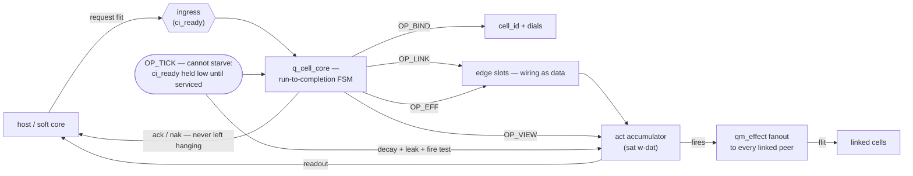

# quilt-verilog

The bottom layer of the quilt, in silicon logic. A cellular learning
fabric — Hebbian edges, power-law forgetting, dial state, a fabric-wide
tick — written in pure, generic Verilog-2005 (IEEE 1364-2005): no vendor
primitives, no IP cores, no SystemVerilog, no floats. Every module is
parameterized, fixed-point, and streaming. It is verified by an 18-bench
testbench suite, six SymbiYosys formal proofs, and a real iCE40 bitstream
produced entirely with open tools, and its complete state travels in one
flat binary file — QUF, the GGUF of cellular silicon — that a testbench,
a soft core, or an FPGA load identically. This page states what exists
and what is verified, matter-of-fact; the deep docs (map below) carry the
rest of the story.

> **From the captain:** The data says the perfect monofilament is √8 mm — 2.83, repeating forever. The fisherman rigs 3. It's on the shelf, it survives the rocks, and it loses nothing you'll notice. That gap between perfect and available is where engineering lives. So we reach for Pythagorean shapes: the angles you can build exactly, the parts already in the bin, the numbers that terminate. A cloud cluster can chase the floating-point optimum. This fabric does it the easy way — integer lattices, snapped directions, standard parts all the way down. The engineer sets the tolerance. The mechanic fits the assembly. The fish doesn't care how many digits you had.

## What is verified, in one table

Every row is either re-run for this README (marked ✓, 2026-08-30) or
measured and recorded in the doc cited. Nothing here is aspirational.

| lane | command | result | where |
|---|---|---|---|
| RTL simulation | `make test` | **21/21 PASS** (✓ re-run 2026-09-03, audit r13; was 18/18 as of 2026-08-30 — grew with q_tern_dice, q_snaplog/q_whistle, crc32-boot lanes) | [docs/VERIFICATION.md](docs/VERIFICATION.md) |
| Behavioral model | `make sim` | **34/34 OK** (✓ re-run 2026-08-30) | [docs/VERIFICATION.md](docs/VERIFICATION.md) |
| Formal proofs | `make formal` | **6/6 PASS** — 5 BMC + 1 k-induction (last full run 2026-08-29, at then-depths tick 80 / fair 80; ⚠ audit r13 2026-09-03: depths since raised to 105/130 and no completed run at the new fair depth is on record — committed snapshot 6e59409 shows fair INCOMPLETE@85, and the r13 re-run exceeded 18 min of solver time at step 87) | [docs/FORMAL-PROOFS.md](docs/FORMAL-PROOFS.md) |
| iCE40 synth + PnR | `make synth && make pnr` | HX8K-CT256: **7,596/7,680 LC (98%), 44.43 MHz post-route @ 12 MHz target, 135,100-byte bitstream** (2026-08-29) | [docs/SYNTHESIS-RESULTS.md](docs/SYNTHESIS-RESULTS.md) |
| Smallest device | — | UP5K sg48, 1 cell: 80.1% LC, 37 IO, **16.78 MHz post-route** (2026-08-29) | [docs/SYNTHESIS-RESULTS.md](docs/SYNTHESIS-RESULTS.md) |
| ECP5 ladder | — | LFE5U-25F: **8 cells @ 63.7 MHz**; real 12F: 4 cells (2026-08-29) | [docs/SYNTHESIS-RESULTS.md](docs/SYNTHESIS-RESULTS.md) |

The proofs are not decoration: their first runs found **two real RTL
defects** (a multi-driven register simulators accepted but yosys
rejected, and a one-cycle ingress-drop hole under a pending tick) — both
fixed, both now regression-guarded ([formal/README.md](formal/README.md)).

## The 5+1 opcode model

One opcode field (3 bits) is the entire instruction set — five host
verbs plus one response channel. There is nothing else. Every dial
write, every training event, every readout, and the passage of time
itself is one of these, executed by `q_cell_core` as a cooperative
run-to-completion FSM (one interpreter per cell; events serialize):

| opcode | encoding | does |
|---|---|---|
| `qm_bind` | `OP_BIND = 0` | first bind sets `cell_id` and binds the cell; later binds write a dial `a0[3:0] <= a1` |
| `qm_link` | `OP_LINK = 1` | edge slot `a0` := `{peer=src, base weight=a1}` — wiring as data |
| `qm_effect` | `OP_EFF = 2` | if src matches a valid edge: train that edge (cofire, echo-gated in v2), read the weight back, integrate `act += sat((w·dat)>>>15)`; unknown src is dropped silently |
| `qm_view` | `OP_VIEW = 3` | read `act` / `wsum(edges)` / a dial; response flit carries the value (no cosine readout in v1 — that path NAKs) |
| `qm_tick` | `OP_TICK = 4` | decay sweep over all valid edges, leak `act`, fire test (`act ≥ thresh ∧ refr = 0`) → fanout effects to every linked peer |
| ack/nak | `OP_ACK = 5`, `OP_NAK = 6` | the +1: every bind/link/view (and every op from an unbound cell, and every undefined opcode) is answered — never left hanging |

The tick is special: it cannot be starved. A pending tick suppresses
ingress acceptance (`ci_ready`) until serviced — non-deferrable time,
proven under permanent ingress flood ([docs/FORMAL-PROOFS.md](docs/FORMAL-PROOFS.md), §4).
One tick traced end-to-end through the RTL: [docs/THE-TICK.md](docs/THE-TICK.md).

How one flit moves through a cell — ingress, the five verbs, the tick's
unstarvable lane, and the answer that always comes back:



## Quickstart — one command per lane

Toolchain: stock oss-cad-suite (Icarus, Yosys, SymbiYosys, boolector,
nextpnr-ice40, icepack). The Makefile pins
`/home/eileen/tools/oss-cad-suite/bin` itself; if yours lives elsewhere:
`make OSSCAD=/path/to/oss-cad-suite/bin <target>` — and if a tool is
missing, the targets fail with a pointed hint, not a bare
`command not found`.

```sh
make verify-all # prove it works: every tutorial (T1..T4) end to end
make test      # RTL testbench suite (iverilog)          — 1-2 min
make sim       # behavioral Python lane (unittest)       — seconds
make formal    # all six SymbiYosys proofs               — ~14 min
make synth     # yosys iCE40 elaboration of the top      — ~20 s
make pnr       # nextpnr-ice40 + icepack → bitstream     — ~3 min
make all       # all five, in order
```

What `make test` printed when this README was written (2026-08-30,
18 PASS lines; abridged — first two and last four, verbatim):

```
$ make test
bash tb/run_suite.sh
PASS  tb_tick_sched: TB_TICK_SCHED PASS
PASS  tb_flit_pipe: TB_FLIT_PIPE PASS
    … 12 more PASS lines …
PASS  tb_hebb_pipe: TB-HEBB-PIPE PASS: 300 ops, 224 lo flits, 18 lx flits, act/trace bit-exact at every checkpoint
PASS  tb_quf_boot: TB-QUF-BOOT PASS: warm-start, corrupt-header fallback, truncation fallback, epoch latch -- all 4 cases
PASS  tb_quf_loader: quf.py selftest PASS: 576 bytes, sha256 5b2a236ba5e38bca9ad96783c4252a12f36517f98a9164a249f0db115f221392, round-trip byte-exact
PASS  tb_serfabric: TB-SERFABRIC PASS: QUF serialized boot byte-exact (2 cells), serial==parallel egress streams (68 flits, cycle-locked), end-state dial rows byte-exact, gate-mode fail-static + release-word epoch + serial-flit config -- all cases
```

What `make sim` printed, complete:

```
$ make sim
python3 -m unittest discover -s sim/tools -p 'test_*.py'
..................................
----------------------------------------------------------------------
Ran 34 tests in 0.009s

OK
```

`make formal` and `make synth && make pnr` were last run green on
2026-08-29 and are recorded, timings included, in
[docs/VERIFICATION.md](docs/VERIFICATION.md) (all lanes) and
[docs/SYNTHESIS-RESULTS.md](docs/SYNTHESIS-RESULTS.md) (the reproduce
commands for every measured number). What each of the six proofs claims
— FIFO safety, ledger conservation, the dyadic echo-gate bracket, tick
deadlines, op-response bounds — is stated in plain mathematics in
[docs/FORMAL-PROOFS.md](docs/FORMAL-PROOFS.md), assumptions included.

## The Law

1. **Pure Verilog-2005 (IEEE 1364-2005), synthesizable subset.** No
   vendor primitives, no IP, no `initial` blocks in `rtl/` (testbenches
   excepted), no SystemVerilog in `rtl/`.
2. **Everything is a cell.** The opcodes above are the only way anything
   touches anything.
3. **Intelligence lives at the bottom.** Hebbian edge updates,
   power-law/hyperbolic decay, dial state — plain RTL, fixed-point,
   streaming. The cosine/vMF reading of those weights is defined in the
   math docs (`docs/academic/`); its dedicated readout is reserved for v1.
4. **Any IO can enter a cell.** One generic ingress/egress contract;
   adapters are thin and dumb.
5. **Verified or it doesn't exist.** Every module ships with a
   testbench runnable on open tools (iverilog/verilator). No toolchain
   lock-in, ever.

## Layout

- `rtl/` — 21 modules (17 fabric + `live_canon.v` the Phase 251 Live Canon + `q_tern_dice.v`, `q_snaplog.v`, `q_whistle.v` — count corrected from 18 in audit r13, 2026-09-03): the winning architecture as built (the truth)
- `tb/` — testbenches, the suite runner, formal harnesses
- `sim/` — behavioral Python prototypes over the same QUF the RTL loads
- `formal/` — machine-checked invariants (SymbiYosys)
- `synth/` — iCE40/ECP5 synthesis + PnR flows and measured tables
- `proposals/<crew>/` — competing architecture entries (the tournament)
- `tools/` — QUF reference implementation, backend fuzz, edge benches
- `docs/` — decisions, math notes, floorplans — map below

## Measured results

Full provenance — every run dated, every artifact named, including two
fmax numbers corrected (post-placement estimates once quoted as final) —
lives in [docs/SYNTHESIS-RESULTS.md](docs/SYNTHESIS-RESULTS.md). Headlines:

| config | device | LC / cap | fmax post-route @ 12 MHz | bitstream |
|---|---|---|---|---|
| `q_fabric_top` k4b4a8e1 (2 cells) | iCE40 HX8K-CT256 | 7,596 / 7,680 (**98%**) | **44.43 MHz** | 135,100 B (tracked) |
| serfabric NCELL=1 (serialized front-end) | iCE40 UP5K sg48 | 4,231 / 5,280 (80.1%), 37/96 IO | **16.78 MHz** | — |
| ladder top | ECP5 LFE5U-25F | 22,791 / 24,288 (94%), 8 cells | **63.7 MHz** | — |

The fmax story across one design's life: 27.72 → 40.44 MHz (the PIPE_EFF
retime, +46%) → 44.43 MHz on the current tree. Every configuration that
closes does so at ≥1.4× the 12 MHz target.

## Honest limitations

Copied in short from [docs/VERIFICATION.md](docs/VERIFICATION.md)'s
not-covered list — read that section before relying on any of this:

- **No on-hardware test.** Every result is simulation, formal, or
  synthesis. The bitstream has never met a board; no PCF exists (IO is
  auto-placed).
- **Unbounded liveness is not claimed.** Five of six proofs are BMC
  (bounded); only the flit-pipe contract is k-inductive. Fair/tick
  proofs rest on stated environment contracts E1–E4.
- **Formal parameters are shrunk.** Conservation is proven at
  EDGES_N=1, K=4, B=4 — not full fabric scale.
- **The Python lane is a model, not a miter** — no formal equivalence
  proof between Python and RTL semantics.
- **No CI.** Verification runs when an iterator runs it.

The prove-mode attempt on conservation exists, failed informatively, and
is documented with its two named strengthening lemmas
([docs/FORMAL-PROOFS.md](docs/FORMAL-PROOFS.md), §2) — the honest statement is
the BMC one.

## The docs map

`docs/INDEX.md` indexes every document in the repo by reader intent. The
short list:

- **Understand**: [THE-TICK](docs/THE-TICK.md) (one tick, traced) ·
  [FOUNDATION](docs/FOUNDATION.md) (the cell axioms) ·
  [QUF-SPEC](docs/QUF-SPEC.md) (state as a file) ·
  [DOCTRINE](docs/DOCTRINE.md) (the bet: llama.cpp, but Verilog and
  cellularized)
- **Verify**: [VERIFICATION](docs/VERIFICATION.md) (every lane) ·
  [FORMAL-PROOFS](docs/FORMAL-PROOFS.md) (the six proofs, plain math) ·
  [SYNTHESIS-RESULTS](docs/SYNTHESIS-RESULTS.md) (measured tables) ·
  [BACKEND-NOTES](docs/BACKEND-NOTES.md) (the adversarial first user:
  23 bug classes found, all fixed with regressions)
- **Build**: [SYNTHESIS](docs/SYNTHESIS.md) →
  [SYNTHESIS-FPGA](docs/SYNTHESIS-FPGA.md) ·
  [FPGA-BOOT](docs/FPGA-BOOT.md) (QUF → cell state at reset)
- **Theory**: [academic/quilt-calculus](docs/academic/quilt-calculus.md) ·
  [GENERAL-CALCULUS](docs/academic/GENERAL-CALCULUS.md) (the capstone) ·
  [error-envelopes](docs/academic/error-envelopes.md) ·
  [THE-BREAKDOWN](docs/academic/THE-BREAKDOWN.md) (every load-bearing
  claim, attacked)
- **History**: [WORLD-CLASS-BRIEF](docs/WORLD-CLASS-BRIEF.md) (the
  standard) · [SCORECARD](docs/SCORECARD.md) (the tournament verdict) ·
  `docs/review-*.md` (the cross-reviews) · the [annals-1905](docs/academic/annals-1905/07-INDEX.md)

## Provenance

This repo's `rtl/` is the built winner of a five-crew architecture
tournament (glm, opencode, zeroclaw, seed, claude — entries under
`proposals/`, cross-reviews in `docs/review-*.md`, verdict in
[docs/SCORECARD.md](docs/SCORECARD.md); the round-2 winner is **glm**, and
failures are kept, first-class, as part of the record). It is the metal
leg of the quilt: the sibling repo `quilt-deck` runs the same cell
semantics on three backends — Python (bit-exact model), ESP32, and an
iverilog cosim against this repo's `rtl/q_serfabric_top.v` with golden
vectors from the differential testbench.

## Iteration protocol

This repo is built by teams of iterators, one theme per pass:
AUDIT → FIX → MEASURE → COMMIT. Every commit states what it verified.
Nothing is ever deleted — archive by rename (the README this page
replaced lives on as `README.archived-20260830.md`).

## Sister projects (the polyformalism)

The Quilt cell is the same cell in 5 substrates. Each is bit-exact
with the others via QUF (the Quilt Universal Format, defined in
[docs/QUF-SPEC.md](docs/QUF-SPEC.md)):

| Substrate | Repo | Language | QUF test |
|---|---|---|---|
| Silicon (this repo) | [quilt-verilog](https://github.com/SuperInstance/quilt-verilog) | Verilog-2005 | native (21/21 RTL + 6/6 sby) |
| C kernel | [quilt-c](https://github.com/SuperInstance/quilt-c) | C99 | 49 QUF conformance tests |
| Rust no_std | [quilt-rust](https://github.com/SuperInstance/quilt-rust) | Rust 2021 | 8 QUF tests |
| Python (time.cell) | [quilt-timesfm](https://github.com/SuperInstance/quilt-timesfm) | Python 3.8+ | native |
| VHDL | [quf-vhdl](https://github.com/SuperInstance/quf-vhdl) | VHDL-2008 | 10/10 byte-exactness tests |

The VHDL sister project ([quf-vhdl](https://github.com/SuperInstance/quf-vhdl))
is a 1:1 port that produces byte-for-byte identical QUF files from
the same JSON input. See the comparison doc
[docs/VERILOG_VS_VHDL.md](https://github.com/SuperInstance/quf-vhdl/blob/main/docs/VERILOG_VS_VHDL.md)
for the 4 logical routes where the two substrates diverge — and the
5 invariants where they converge.
