# DEPENDENCY-GRAPH — the quilt concept lattice, fully linked

**Lane:** rigor-auditor (Flash — dependency-closure + elegance pass) · **Date:** 2026-08-29
**Docs audited:** `docs/FOUNDATION.md` (the cell, judgment pseudometrics, ledger, distribution algebra) and `docs/SEMANTIC-TOWER.md` (compiler stack, snap contract, maintenance-zoom). Cross-doc anchors checked: `SYNTHESIS.md` (I1/I2/Q2/Q3), `QUF-SPEC.md`, `ABSTRACTION-MATH.md`, `README.md` (Laws 1–5), `BACK-DECK-APP.md`.
**Bar:** foundation-to-foundation, every abstraction linked, no leaps.

**Gap declared up front (G1):** `docs/academic/quilt-calculus.md` is **absent** — the concurrent lane has not landed it. This audit covers the two committed formal docs above and notes the integration point. See §6.

---

## 1. Method

For every definition (D#), theorem (T#), lemma, proposition, invariant, and named notation in the two audited docs, we record: **what it depends on**, and **whether each dependency is defined earlier** (same doc or an already-committed companion) or **explicitly marked as a forward reference / informal / open**. A **LEAP** is one of:

1. an undefined term used in a proof,
2. a theorem citing a concept not yet formalized,
3. a proof step that skips algebra (a claim asserted where a derivation is required).

Severity classes:

| Class | Meaning |
|---|---|
| **LEAP** (L#) | content leap per the bar — fixed in `BRIDGES.md` (real derivation) or listed as an explicit gap |
| **FWD** (F#) | benign forward reference (defined later in the same doc, one-way, non-circular) or missing cross-doc pointer |
| **VERIFIED** | claim checked, derivable as stated (or with a one-line slack note) |
| **INFORMAL** (I#) | explicitly marked informal / poetic — not a leap by the audit rule, but recorded |
| **OPEN** (P#) | owned open problem (FOUNDATION §5) — not a leap |
| **COND** | conditional on a convention that is honestly marked "specified, not built" (§8 of the tower) |

---

## 2. The concept inventory

### 2.1 FOUNDATION.md (`F`)

| ID | Concept | Where | Depends on | Earlier? | Status |
|---|---|---|---|---|---|
| F0.1 | State: set `S`, byte-addressable, file doctrine | §0 | — | — | primitive |
| F0.2 | Time: local clock, logical instants, tick | §0 | — | — | primitive |
| F0.3 | Event: serialized per cell (Law 2), total order per cell, no global order | §0 | README Law 2 | pointer missing (F3) | primitive |
| F0.4 | Commit boundary: one event = one commit; no multi-cell atomic commit | §0 | F0.3 | yes | primitive |
| F0.5 | Account: named integer counter, per-cell | §0 | F0.1 | yes | primitive |
| F0.6 | Notation `ℤ`, `ℝ≥0`, `𝒫(X)`, `A→B`, `x:T` | §0 | — | — | primitive |
| **F-D1** | **Cell** `C = (S, J, L, τ, δ)`; quilt = finite cells + links; five-opcode table | §1 | F0.1, F0.2, F0.3, F0.5, F-D2, F-D3 | D2, D3 defined *after* D1 in presentation | **FWD (F1)** — benign: D1 is a tuple over objects defined in §1.1–1.2; resolution in BRIDGES §7 |
| F-D2.0 | Pseudometric / metric | §1 (inline) | F0.6 | yes | VERIFIED (standard) |
| **F-D2** | **Judgment** `J = (A, r)`, verdict set `V(x)`, ACCEPT/AMBIGUOUS/REJECT | §1 | F0.1 (`r : S → ℝ≥0`), F0.6, F-D2.0, input space `X`, classes `K` (primitive) | yes (given F0.1) | OK |
| F-P2.1 | Exact match = r=0 discrete-metric case | §1 | F-D2 | yes | VERIFIED |
| F-P2.2 | Monotone in `r`: `r ≤ r′ ⟹ V_r(x) ⊆ V_r′(x)` | §1 | F-D2 | yes | VERIFIED — `{a : d(x,a) ≤ r} ⊆ {a : d(x,a) ≤ r′}` |
| F-P2.3 | AMBIGUOUS never guesses (verdict set, not score) | §1 | F-D2 | yes | VERIFIED (definitional) |
| F-P2.4 | Verification = judgment at log-2 tolerance (`d = |log x − log y|`) | §1 | F-D2, SYN-Q3 | yes | VERIFIED with slack: `d ≤ log 2 ⟺ ½ ≤ x/y ≤ 2`; the Q3 gate adds integer ±1 slack → looser judge, harmless |
| **F-D3** | **Ledger**: posting, transaction `T = (n, {(aᵢ,vᵢ)})`, `Σvᵢ = 0`, apply, nonce idempotence, cleared/in-flight, crosses a cut | §1 | F0.5, F0.6 | yes | OK |
| F-D3.1 | Conservation cut: `Σ_{a∈accounts(𝒞)} bal(a) = K_𝒞` | §1 | F-D3 | yes | OK |
| F-D3.2 | Account ownership: exactly one cell may post to each account | §1 (consensus paragraph) | F-D3 | yes (before D5 uses it) | OK — unnumbered in source; numbered here |
| **F-T1** | **Proposition: consistency without consensus** | §1 | F-D3, F-D3.1, F-D3.2, F0.3, F0.4 | yes | **LEAP L5** — proof is a sketch; the induction needs (a) well-foundedness of the global commit partial order, (b) cut-constant algebra, (c) in-flight equality. Fixed → BRIDGES B1 |
| F-W3 | Worked example: the label bus (T₁ T₂ T₃) | §1 | F-D3 | yes | VERIFIED — each of T₁–T₃ sums to zero |
| **F-D4** | **Session illusion**: (F,L)-bounded view; illusion parameter F; queries spaced > F+L | §1 | F-D1 (qm_view), F0.3, F0.4, SYN-I2, SYN-Q2 | yes | OK (contract) |
| **F-T2** | **Illusion indistinguishability** (observer cannot distinguish from synchronous) | §1 | F-D4 | yes | **LEAP L4** — asserted, no proof; the ordering argument (spacing > F+L ⟹ strictly increasing commit times) is the missing algebra. Fixed → BRIDGES B2 |
| F-DC1 | Category CELLS (informal): objects cells, morphisms wirings, functor laws | §2 | F-D1, qm_link; grounded in AMATH §1 (traced symmetric monoidal) | yes | OK (informal but explicitly so; external grounding cited) |
| **F-D5.1** | **Mirror**: J′=J, τ′=τ, same nonce stream; convergence by idempotence | §2 | F-D3, F-D3.2, F-D1 | yes | OK |
| **F-T3** | **Mirror convergence** (identical bal, modulo in-flight, no order agreement) | §2 | F-D5.1, F-D3 | yes | **LEAP L6** — needs the posting-commutativity lemma (final bal = bal₀ + Σ postings over the applied-nonce set, order-independent). Fixed → BRIDGES B3 |
| **F-D5.2** | **Stripe**: placement `σ : cells → sites`, functor `S_σ`, wiring survives placement | §2 | F-DC1, F-D3.2, flit contract | yes | OK |
| F-T4 | Stripe functor law `S_σ(g∘f) = S_σ(g)∘S_σ(f)` | §2 | F-D5.2 | yes | COND — honest: "provided every cut respects the flit contract"; seam risk owned in P1 |
| **F-D5.3** | **Nest**: composite cell, consolidations, monad shape | §2 | F-D3, F-D1, F-D6 (QUF) | QUF defined later (§4) | **FWD (F2)** — benign: one-way reference, "state-is-a-file makes nesting literal" |
| **F-T5** | **Consolidation lemma** (interior nets to zero at boundary) | §2 | F-D5.3, F-D3 | yes | **LEAP L7** — needs the precise account-partition statement. Fixed → BRIDGES B4 |
| F-T6 | Nest monad laws (associativity, identity) | §2 | F-T5 | yes | **LEAP L7** — associativity/identity not derived. Fixed → BRIDGES B4 |
| **F-D5.4** | **Embed**: functor `E : P → CELLS`, Law 4 honesty | §2 | F-DC1, F-D2 (r=0 checksum), README Law 4 | pointer missing (F3) | OK |
| **F-D5.5** | **Agree**: nominal interface theory, handshake as balanced transaction | §2 | F-D3, F-D1 | yes | **LEAP L3** — "each side posts consent" is asserted balanced but the postings are never exhibited; the claim is not checkable. Fixed → BRIDGES B5 |
| F-T7 | Backend theorem (informal Claim) | §2 | F-D1–F-D5 | yes | INFORMAL (I1) — explicitly marked, asterisk owned in P1 |
| F-T8 | Security: no fabrication (conservation) | §3.1 | F-T1, F-D3.1 | yes | VERIFIED — closed-cut conservation; minting requires an unbalanced transaction |
| F-T9 | Security: provenance = replay | §3.1 | F-D3 | yes | VERIFIED — `bal(s) = bal(0) + Σ postings`; replay is self-contained |
| F-T10 | Security: tamper-evidence | §3.1 | F-D3 | yes | VERIFIED — single-sided edit breaks `Σvᵢ = 0` |
| F-T11 | Security: safe retry | §3.1 | F-D3 (nonce) | yes | VERIFIED (definitional) |
| F-T12 | Security: reversible action (quarantine = closing entries) | §3.1 | F-D3 | yes | VERIFIED — T₃ is balanced |
| **F-D6** | **QUF** (formal): `enc : S → {0,1}*`, sim/loader decode identical, tolerance-bounded where not bit-exact | §4 | F-D1 (S), F-D2, QUF-SPEC, `tools/quf.py`, `rtl/q_uf_loader.v` | yes | OK |
| F-T13 | Verification is the judgment that two interpretations agree within tolerance | §4 | F-D2, F-D6, README Law 5, SYN-Q3 | yes | VERIFIED — instance: `wsum == base + N·2⁸` exact pre-shift (SYNTHESIS Q3), consistent with the ladder spec |
| F-P1 | Freshness vs partition (candidate Lyapunov: cut discrepancy) | §5 | F-D4, F-D3.1 | yes | OPEN (owned) |
| F-P2 | Judgment-metric drift | §5 | F-D2 | yes | OPEN (owned) |
| F-P3 | Ledger pruning without history loss | §5 | F-D3, F-D3.1 | yes | OPEN (owned) |
| F-A1..5 | Appendix one-liners | App | D1–D5 | yes | restatements |

### 2.2 SEMANTIC-TOWER.md (`S`)

| ID | Concept | Where | Depends on | Earlier? | Status |
|---|---|---|---|---|---|
| S-L0 | Tower levels table | §0 | — | — | structure |
| **S-D1** | **L0 cell** `N = (name, io, raw, eq, links, dials)` | §1 | F-D1 (cell), F-D5.2 (links) | cross-doc, committed earlier | OK |
| **S-D2** | **Attention horizon** (edit set; below-horizon = semantics-preserving) | §1 | S-D1 | yes | OK |
| **S-T1** | **Language-below-the-horizon lemma** | §1 | S-D2, F-D2 (dials), integer basis (formalized later in §5.3) | mechanism forward-referenced | **LEAP L10** — "integer arithmetic is exact in every substrate" is the load-bearing step, never stated as a lemma; empirical anchor (§8: reflex-arc 100.0000%, 500 vectors) is cited, not derived. Fixed → BRIDGES B6 |
| S-D2.5 | L1 opcodes: five verbs; commitment checkable pre-target; portable by construction | §2 | F-D1 (opcode table), F-D3 (auditable balance) | yes | OK |
| **S-D3** | **L2 manifests**; middle-layer selection rule (judgment at zero tolerance) | §3 | F-D2, S-K1 | yes | OK — D2 with discrete metric, r=0 is exactly exact-match |
| **S-D4** | **L3 binaries**: hash-anchored, warm-loadable, provenance-carrying | §4 | F-D6, QUF-SPEC §8 (extensibility) | yes | OK |
| **S-D5** | **Snap pair** (G, T, x, g, s, Δ, J_snap — D2 with integer metric, r=Δ, inverted polarity) | §5.2 | F-D1, F-D2 | yes | OK |
| S-T2 | Squared-form equivalence `d² ≤ Δ² ⟺ d ≤ Δ` | §5.2 | S-D5 | yes | VERIFIED — `t ↦ t²` strictly increasing on `ℝ≥0`; judge float-free since d², Δ² ∈ ℤ |
| **S-D6** | **Measurement basis** `b`, integer sufficiency `dist(x, bℤⁿ) ≤ ε` | §5.3 | F0.6 | yes | OK |
| **S-T3** | **Basis inequality** `b ≤ 2ε/√n` (covering radius `b√n/2`) | §5.3 | S-D6 | yes | **LEAP L8** — the covering radius is asserted, not proved. Fixed → BRIDGES B7 |
| S-D7 | Pythagorean configurations `{v ∈ ℤⁿ : ‖v‖ ∈ ℤ}`; 2D = 3-4-5 family | §5.3 | S-D6 | yes | VERIFIED — distance 0 by construction |
| **S-T4** | **Float-free loop proposition** | §5.3 | S-T2, S-T3, S-D7, F-D2, AMATH (paper 67 dyadic staircases) | yes | **LEAP L9** — the error budget (`ε` must be the *sum* of representation + sensor + envelope error; post-correction vs between-correction bounds) is assembled by prose. Fixed → BRIDGES B8 |
| **S-D8** | **Snap event** `T_snap` (3 postings as written) | §5.4 | F-D3 | yes | **LEAP L1** — **the transaction as written is unbalanced: `Σ = −1 + 1 + |g−s| = |g−s| ≠ 0`.** Direct violation of F-D3's `Σvᵢ = 0`. Fixed → BRIDGES B9 |
| S-D8′ | Snap event, fixed (4 postings) | BRIDGES B9 | F-D3 | — | FIXED |
| S-T5 | Dual-ledger single-nonce semantics | §5.4 | F-D3 (crossing-transaction model) | yes | VERIFIED — this is exactly F-D3's cut-crossing semantics; in-flight until both commits |
| S-D9 | Fixed timestep = τ; no allocation in loop = state-is-a-file | §5.4 | F-D1 (τ), F-D6 | yes | VERIFIED (identification, not new content) |
| **S-T6** | **Snap contract one-liner** (incl. "never displays divergence beyond max(Δ, sensor error)") | §5.5 | S-T4, S-T5 | yes | **LEAP L2** — the max-form is an overclaim; triangle inequality yields the *sum* `Δ + ε_s` (plus per-tick drift for sampled |g−s|). Fixed → BRIDGES B10 |
| **S-D10** | **Invariant M** (rendering chain; zoom) | §6 | S-D1 (eq), F-D1 (links), S-D4 (§4.3 provenance KV) | yes | COND — provenance KV keys are "specified, not built" (§8, honest); M holds where the convention is carried |
| S-T7 | Corollary: debugging is zooming (three failure sites, no fourth) | §6 | S-D10 | yes | VERIFIED — given M: chain endpoint wrong ⟹ some fᵢ wrong (cell) or some arrow wrong (link) or raw wrong (IO leaf); no other site |
| S-T8 | Corollary: tower read top-down (zoom = inverse of compilation) | §6 | S-D10, S-D4 | yes | INFORMAL (I3) — marked, no formal claim |
| S-K1 | Substrate capability table | §7 | S-D3, F-D4 (latency class), SYN-Q2 | yes | OK (knowledge table, not theorem) |

### 2.3 External anchors (cited, not defined in the audited docs)

| Anchor | Cited by | Status |
|---|---|---|
| README Laws 1–5 (canonical list at repo root) | F0.3, F-D5.4, F-T13, S-D3, SYNTHESIS | **F3** — cited without pointer; the list *exists* (README), so content is fine; add explicit pointers |
| SYNTHESIS I1/I2 (bounded ops; view-latency bound) | F-D4 | OK — I2's premises (I1, Q2) are simulation-enforced; machine-proof pending (AMATH checklist #3/#4) — honest chain, marked |
| SYNTHESIS Q2 (hard-interlocked tick) | F-D4, S-D9 | OK — enforced by `tb/tb_cell_core.v`; formal proof pending (AMATH #4) |
| SYNTHESIS Q3 (golden envelope bounds) | F-P2.4, F-T13, S-T4 | OK — see slack note F-P2.4; ELEGANCE E4 tightens the assertion form |
| QUF-SPEC §8 (extensibility), §9 (loader profile) | F-D6, S-D4, S-D10 | OK |
| ABSTRACTION-MATH §1/§5 (traced monoidal; staircase envelope theorem) | F-DC1, S-T4 | OK — the envelope theorem is a one-line proof (ELEGANCE E4) |
| ai-writings papers 66/67/68/70 | S-T4, F-D2, F-D3 | external research companion, cited by name — not in repo scope |

---

## 3. The dependency graph (mermaid)

```mermaid
graph TD
    subgraph PRIM["Primitives (FOUNDATION §0)"]
        P_state["F0.1 State S"]
        P_time["F0.2 Time / tick"]
        P_event["F0.3 Event serialization"]
        P_commit["F0.4 Commit boundary"]
        P_acct["F0.5 Account"]
        P_math["F0.6 Notation ℤ ℝ≥0"]
    end

    subgraph FOUND["FOUNDATION.md"]
        D2m["F-D2.0 pseudometric"]
        D2["F-D2 Judgment J=(A,r)"]
        D3["F-D3 Ledger"]
        D31["F-D3.1 Conservation cut"]
        D32["F-D3.2 Account ownership"]
        T1["F-T1 Consistency without consensus"]
        D1["F-D1 Cell C=(S,J,L,τ,δ)"]
        D4["F-D4 Session illusion"]
        T2["F-T2 Illusion indistinguishability"]
        CAT["F-DC1 Category CELLS"]
        MIR["F-D5.1 Mirror"]
        T3["F-T3 Mirror convergence"]
        STR["F-D5.2 Stripe"]
        NST["F-D5.3 Nest"]
        T5["F-T5 Consolidation lemma"]
        T6["F-T6 Nest monad laws"]
        EMB["F-D5.4 Embed"]
        AGR["F-D5.5 Agree"]
        BCK["F-T7 Backend theorem (informal)"]
        D6["F-D6 QUF"]
        SEC["F-T8..T12 Security"]
        T13["F-T13 Verification is judgment"]
        P1["F-P1 Freshness vs partition (open)"]
        P2["F-P2 Judgment-metric drift (open)"]
        P3["F-P3 Ledger pruning (open)"]
    end

    subgraph TOW["SEMANTIC-TOWER.md"]
        L0c["S-D1 L0 cell"]
        AH["S-D2 Attention horizon"]
        LHL["S-T1 Below-horizon lemma"]
        OPC["S-D2.5 L1 opcodes"]
        L2m["S-D3 L2 manifests"]
        L3b["S-D4 L3 binaries"]
        SP["S-D5 Snap pair"]
        SQ["S-T2 Squared form"]
        MB["S-D6 Measurement basis"]
        BI["S-T3 Basis inequality"]
        PY["S-D7 Pythagorean config"]
        FFL["S-T4 Float-free loop"]
        SN["S-D8 Snap event"]
        SNCT["S-T6 Snap contract"]
        MZ["S-D10 Invariant M"]
        DZ["S-T7 Debugging is zooming"]
        TAB["S-K1 Substrate table"]
    end

    subgraph EXT["External anchors"]
        LAWS["README Laws 1-5"]
        SYNI2["SYNTHESIS I1/I2/Q2/Q3"]
        QUFSP["QUF-SPEC"]
        AMATH["ABSTRACTION-MATH"]
        P67["paper 67 dyadic staircases"]
    end

    P_state --> D2 --> D1
    P_math --> D2m --> D2
    P_acct --> D3
    P_event --> D3 --> D31 --> T1
    P_commit --> T1
    D32 --> T1
    D3 --> D32
    D1 --> D4 --> T2
    SYNI2 --> D4
    D1 --> CAT
    D3 --> MIR --> T3
    D32 --> MIR
    CAT --> STR
    D32 --> STR
    D3 --> NST
    D6 --> NST
    NST --> T5 --> T6
    CAT --> EMB
    D2 --> EMB
    D3 --> AGR
    D1 --> BCK
    D3 --> SEC
    T1 --> SEC
    D1 --> D6
    D2 --> D6
    D6 --> T13
    D2 --> T13
    D4 --> P1
    D31 --> P1
    D2 --> P2
    D3 --> P3
    D31 --> P3
    LAWS --> F0_3_["F0.3 (Law 2)"] --> P_event
    LAWS --> EMB
    LAWS --> T13
    D1 --> L0c
    L0c --> AH --> LHL
    D1 --> OPC
    F_D2_["F-D2"] --> LHL
    F_D2_ --> SP --> SQ
    L0c --> MZ --> DZ
    SP --> SN
    D3 --> SN
    SP --> SNCT
    FFL --> SNCT
    MB --> BI
    BI --> FFL
    PY --> FFL
    SQ --> FFL
    D6 --> L3b
    QUFSP --> L3b
    QUFSP --> D6
    AMATH --> CAT
    AMATH --> FFL
    P67 --> FFL
    TAB --> L2m
    L0c --> OPC --> L2m --> L3b
    L3b --> MZ

    classDef leap fill:#fdd,stroke:#c00,stroke-width:2px;
    classDef fwd fill:#ffd,stroke:#a80;
    classDef ok fill:#dfd,stroke:#080;
    classDef open fill:#eef,stroke:#00a;
    class T1,T2,T3,T5,T6,LHL,BI,FFL,SN,SNCT leap;
    class D1,NST fwd;
    class D2,D3,D4,MIR,STR,EMB,AGR,D6,L0c,MZ ok;
    class P1,P2,P3 open;
```

---

## 4. Leaps found (10), with dispositions

| # | Leap | Doc/§ | Type | Severity | Disposition |
|---|---|---|---|---|---|
| **L1** | Snap transaction `T_snap` is **unbalanced** (`Σ = |g−s| ≠ 0`) — violates the doc's own D3 | S §5.4 | proof step skips algebra | **critical** | FIXED → BRIDGES B9 (four-posting balanced form + conservation invariant) |
| **L2** | "Never displays divergence beyond `max(Δ, sensor error)`" — triangle inequality gives the **sum** `Δ + ε_s`; max-form not derivable | S §5.5 | overclaim | high | FIXED → BRIDGES B10 |
| **L3** | Agree-handshake "balanced transaction" asserted; postings never exhibited — not checkable | F §2 (D5.5) | undefined term in a claim | high | FIXED → BRIDGES B5 (exhibit canonical transaction; link = shared nonce) |
| **L4** | Illusion indistinguishability asserted, no proof; missing ordering algebra | F §1 (D4) | theorem without proof | high | FIXED → BRIDGES B2 |
| **L5** | Consistency-without-consensus proof is a sketch: no well-foundedness argument, no cut-constant induction, in-flight equality asserted | F §1 (T1) | proof step skips algebra | high | FIXED → BRIDGES B1 |
| **L6** | Mirror convergence: "no order agreement required" needs the posting-commutativity lemma | F §2 (D5.1) | lemma missing | medium | FIXED → BRIDGES B3 |
| **L7** | Nest consolidation lemma + monad laws: precise account-partition statement and associativity/identity derivations missing | F §2 (D5.3) | lemma missing | medium | FIXED → BRIDGES B4 |
| **L8** | Covering radius `b√n/2` asserted, not proved | S §5.3 | proof step skips algebra | medium | FIXED → BRIDGES B7 |
| **L9** | Float-free loop: error budget assembled by prose; `ε` must be a sum; post-/between-correction bounds conflated | S §5.3 | proof step skips algebra | medium | FIXED → BRIDGES B8 |
| **L10** | Below-the-horizon lemma: "integer arithmetic is exact in every substrate" never stated as a lemma | S §1 | lemma missing | medium | FIXED → BRIDGES B6 |

**Leaps found: 10. Fixed: 10. Remaining content leaps: 0.**

### Benign forward references / notes (not leaps)

| # | Note | Disposition |
|---|---|---|
| F1 | D1 presented before D2/D3 whose objects it names; D2's `r : S → ℝ≥0` reads D1's S. No vicious circle: S is primitive (§0), D2/D3 can be defined first, D1 assembles | resolved in BRIDGES §7 (correct definition order) |
| F2 | Nest cites QUF (formal def §4) — one-way forward reference | benign; D6 does not depend on D5.3 |
| F3 | Laws 2/4/5 cited without pointer; canonical list is README "The Law" | resolved in BRIDGES §7 (pointer) |
| F4 | "§1.3 explains why none is needed" — the argument lives in the D3 consensus paragraph; stale cross-ref | cosmetic |
| F5 | SYNTHESIS Q3 assertion `W/2 − 1 ≤ Ŵ ≤ 2W + 1` vs. proven envelope `[W, 2W)`: the ±1 is integer slack, the /2 is fourfold looseness; assertion can be tightened to `W − 1 ≤ Ŵ ≤ 2W + 1` without touching RTL | ELEGANCE E4 |

### Explicitly informal / open / conditional (recorded, not leaps)

- I1: Backend theorem (marked informal; asterisk → P1).
- I2: "Band-limited truth" (poetic gloss on F-D4).
- I3: "Zoom is the inverse of compilation" (informal corollary).
- OPEN: F-P1, F-P2, F-P3 (owned, stated with what is known and what is missing).
- COND: S-D10 invariant M (holds where §4.3 provenance keys are carried; keys are "specified, not built" — honest per S §8).

---

## 5. Dependency-closure verdict (Casey's bar)

- **Every definition and theorem in both docs now has its dependencies defined earlier or explicitly marked** (FWD / INFORMAL / OPEN / COND). The two doc-order forward references (F1, F2) are benign and resolved in BRIDGES §7.
- **All 10 content leaps are fixed in `BRIDGES.md` with real derivations** (B1–B10), not prose gestures.
- **No undefined term remains in a proof.** The only cited-but-unformalized objects are: Laws 1–5 (defined in README — pointer added), SYNTHESIS I1/I2/Q2/Q3 (defined and enforced in SYNTHESIS; machine-proof pending and honestly flagged there), QUF-SPEC, ABSTRACTION-MATH, and the ai-writings papers (external companions, cited by name).
- **One explicit gap (G1):** `docs/academic/quilt-calculus.md` is absent. When it lands, the audit should re-run §2.2 against it (it is expected to add calculus-level derivations on top of D1–D5 and the snap contract; its absence means the "no leaps" verdict covers the two committed formal docs only).

---

## 6. Gap register

| ID | Gap | Owner | Status |
|---|---|---|---|
| G1 | `docs/academic/quilt-calculus.md` not committed (concurrent lane) | calculus lane | open — audit re-run required on landing |
| G2 | SYNTHESIS I1/I2/Q2/Q3 premises simulation-enforced; sby machine-proofs (AMATH checklist #3/#4) pending | formal lane | open — honest, tracked in AMATH |
| G3 | Invariant M's provenance KV keys (§4.3) specified, not built | semantic-tower lane | open — M conditional until QUF keys ship |

*Rigor-auditor lane, 2026-08-29. Companions: `BRIDGES.md` (the 10 fixes), `ELEGANCE.md` (the five shortest forms).*
