# DEPENDENCY-GRAPH — the quilt concept lattice, fully linked

**Lane:** rigor-auditor (Flash — dependency-closure + elegance pass) · **Date:** 2026-08-29
**Docs audited:** `docs/FOUNDATION.md` (the cell, judgment pseudometrics, ledger, distribution algebra) and `docs/SEMANTIC-TOWER.md` (compiler stack, snap contract, maintenance-zoom). Cross-doc anchors checked: `SYNTHESIS.md` (I1/I2/Q2/Q3), `QUF-SPEC.md`, `ABSTRACTION-MATH.md`, `README.md` (Laws 1–5), `BACK-DECK-APP.md`.
**Bar:** foundation-to-foundation, every abstraction linked, no leaps.

**Re-sweep (G1 closure, same day):** `docs/academic/quilt-calculus.md` landed (commit `0e0e851`) after this audit's tree snapshot was taken; this document now extends the audit to it — **§2.4** (full statement inventory, 18 D + 7 A + 11 T + 2 P + 3 C), **§4** (re-sweep findings: 5 benign forward refs, 4 term-drift notes, 0 content leaps), **§7** (cross-doc reconciliation: cell tuple, snap transaction naming, envelopes parameter dictionary). **G1 is closed** — see §6. Note the timeline: the calculus commit (11:51) *predates* this audit's commit (11:56); the two lanes ran concurrently on divergent trees, which is why B9 and CALC-T10(b) independently discovered the same snap-transaction defect (convergent finding, §7.2).

**Expansion sweep (same day, evening):** four academic-expansion papers landed (`RHO-F-FLOOR.md`, `DRIFT-AS-PREFILTER.md`, `FOLD-COVERED.md`, `DENY-BY-RUNNING.md`); this document extends the audit to them — **§2.5** (full inventory, all four registries), **§4** (expansion sweep findings: 0 content leaps, 1 declared forward ref, 2 flagged source-corrections), mermaid §3 (EXP subgraph + edges). Gap G4 registers their unexecuted benches.

**Generals sweep (same day, night):** `GENERAL-CALCULUS.md` landed (the capstone: the abstract cell calculus, quilt-shape axioms Q1–Q5, four generalization axes, the product theorem, the compiler correspondence, four conjectures with registered falsifiers); this document extends the audit to it — **§2.6** (full inventory), **§4** (generals sweep findings: 0 content leaps, 0 forward refs, 1 proof-method declaration [proof-inspection lemmas GC-L1/L2, self-graded]), mermaid §3 (GC node + edges). Gap G5 registers its unexecuted benches.

---

## 1. Method

For every definition (D#), theorem (T#), lemma, proposition, invariant, and named notation in the two audited docs, we record: **what it depends on**, and **whether each dependency is defined earlier** (same doc or an already-committed companion) or **explicitly marked as a forward reference / informal / open**. A **LEAP** is one of:

1. an undefined term used in a proof,
2. a theorem citing a concept not yet formalized,
3. a proof step that skips algebra (a claim asserted where a derivation is required).

Severity classes:

| Class | Meaning |
|---|---|
| **LEAP** (L#) | content leap per the bar — fixed in `BRIDGES.md` (real derivation) or listed as an explicit gap |
| **FWD** (F#) | benign forward reference (defined later in the same doc, one-way, non-circular) or missing cross-doc pointer |
| **VERIFIED** | claim checked, derivable as stated (or with a one-line slack note) |
| **INFORMAL** (I#) | explicitly marked informal / poetic — not a leap by the audit rule, but recorded |
| **OPEN** (P#) | owned open problem (FOUNDATION §5) — not a leap |
| **COND** | conditional on a convention that is honestly marked "specified, not built" (§8 of the tower) |

---

## 2. The concept inventory

### 2.1 FOUNDATION.md (`F`)

| ID | Concept | Where | Depends on | Earlier? | Status |
|---|---|---|---|---|---|
| F0.1 | State: set `S`, byte-addressable, file doctrine | §0 | — | — | primitive |
| F0.2 | Time: local clock, logical instants, tick | §0 | — | — | primitive |
| F0.3 | Event: serialized per cell (Law 2), total order per cell, no global order | §0 | README Law 2 | pointer missing (F3) | primitive |
| F0.4 | Commit boundary: one event = one commit; no multi-cell atomic commit | §0 | F0.3 | yes | primitive |
| F0.5 | Account: named integer counter, per-cell | §0 | F0.1 | yes | primitive |
| F0.6 | Notation `ℤ`, `ℝ≥0`, `𝒫(X)`, `A→B`, `x:T` | §0 | — | — | primitive |
| **F-D1** | **Cell** `C = (S, J, L, τ, δ)`; quilt = finite cells + links; five-opcode table | §1 | F0.1, F0.2, F0.3, F0.5, F-D2, F-D3 | D2, D3 defined *after* D1 in presentation | **FWD (F1)** — benign: D1 is a tuple over objects defined in §1.1–1.2; resolution in BRIDGES §7 |
| F-D2.0 | Pseudometric / metric | §1 (inline) | F0.6 | yes | VERIFIED (standard) |
| **F-D2** | **Judgment** `J = (A, r)`, verdict set `V(x)`, ACCEPT/AMBIGUOUS/REJECT | §1 | F0.1 (`r : S → ℝ≥0`), F0.6, F-D2.0, input space `X`, classes `K` (primitive) | yes (given F0.1) | OK |
| F-P2.1 | Exact match = r=0 discrete-metric case | §1 | F-D2 | yes | VERIFIED |
| F-P2.2 | Monotone in `r`: `r ≤ r′ ⟹ V_r(x) ⊆ V_r′(x)` | §1 | F-D2 | yes | VERIFIED — `{a : d(x,a) ≤ r} ⊆ {a : d(x,a) ≤ r′}` |
| F-P2.3 | AMBIGUOUS never guesses (verdict set, not score) | §1 | F-D2 | yes | VERIFIED (definitional) |
| F-P2.4 | Verification = judgment at log-2 tolerance (`d = |log x − log y|`) | §1 | F-D2, SYN-Q3 | yes | VERIFIED with slack: `d ≤ log 2 ⟺ ½ ≤ x/y ≤ 2`; the Q3 gate adds integer ±1 slack → looser judge, harmless |
| **F-D3** | **Ledger**: posting, transaction `T = (n, {(aᵢ,vᵢ)})`, `Σvᵢ = 0`, apply, nonce idempotence, cleared/in-flight, crosses a cut | §1 | F0.5, F0.6 | yes | OK |
| F-D3.1 | Conservation cut: `Σ_{a∈accounts(𝒞)} bal(a) = K_𝒞` | §1 | F-D3 | yes | OK |
| F-D3.2 | Account ownership: exactly one cell may post to each account | §1 (consensus paragraph) | F-D3 | yes (before D5 uses it) | OK — unnumbered in source; numbered here |
| **F-T1** | **Proposition: consistency without consensus** | §1 | F-D3, F-D3.1, F-D3.2, F0.3, F0.4 | yes | **LEAP L5** — proof is a sketch; the induction needs (a) well-foundedness of the global commit partial order, (b) cut-constant algebra, (c) in-flight equality. Fixed → BRIDGES B1 |
| F-W3 | Worked example: the label bus (T₁ T₂ T₃) | §1 | F-D3 | yes | VERIFIED — each of T₁–T₃ sums to zero |
| **F-D4** | **Session illusion**: (F,L)-bounded view; illusion parameter F; queries spaced > F+L | §1 | F-D1 (qm_view), F0.3, F0.4, SYN-I2, SYN-Q2 | yes | OK (contract) |
| **F-T2** | **Illusion indistinguishability** (observer cannot distinguish from synchronous) | §1 | F-D4 | yes | **LEAP L4** — asserted, no proof; the ordering argument (spacing > F+L ⟹ strictly increasing commit times) is the missing algebra. Fixed → BRIDGES B2 |
| F-DC1 | Category CELLS (informal): objects cells, morphisms wirings, functor laws | §2 | F-D1, qm_link; grounded in AMATH §1 (traced symmetric monoidal) | yes | OK (informal but explicitly so; external grounding cited) |
| **F-D5.1** | **Mirror**: J′=J, τ′=τ, same nonce stream; convergence by idempotence | §2 | F-D3, F-D3.2, F-D1 | yes | OK |
| **F-T3** | **Mirror convergence** (identical bal, modulo in-flight, no order agreement) | §2 | F-D5.1, F-D3 | yes | **LEAP L6** — needs the posting-commutativity lemma (final bal = bal₀ + Σ postings over the applied-nonce set, order-independent). Fixed → BRIDGES B3 |
| **F-D5.2** | **Stripe**: placement `σ : cells → sites`, functor `S_σ`, wiring survives placement | §2 | F-DC1, F-D3.2, flit contract | yes | OK |
| F-T4 | Stripe functor law `S_σ(g∘f) = S_σ(g)∘S_σ(f)` | §2 | F-D5.2 | yes | COND — honest: "provided every cut respects the flit contract"; seam risk owned in P1 |
| **F-D5.3** | **Nest**: composite cell, consolidations, monad shape | §2 | F-D3, F-D1, F-D6 (QUF) | QUF defined later (§4) | **FWD (F2)** — benign: one-way reference, "state-is-a-file makes nesting literal" |
| **F-T5** | **Consolidation lemma** (interior nets to zero at boundary) | §2 | F-D5.3, F-D3 | yes | **LEAP L7** — needs the precise account-partition statement. Fixed → BRIDGES B4 |
| F-T6 | Nest monad laws (associativity, identity) | §2 | F-T5 | yes | **LEAP L7** — associativity/identity not derived. Fixed → BRIDGES B4 |
| **F-D5.4** | **Embed**: functor `E : P → CELLS`, Law 4 honesty | §2 | F-DC1, F-D2 (r=0 checksum), README Law 4 | pointer missing (F3) | OK |
| **F-D5.5** | **Agree**: nominal interface theory, handshake as balanced transaction | §2 | F-D3, F-D1 | yes | **LEAP L3** — "each side posts consent" is asserted balanced but the postings are never exhibited; the claim is not checkable. Fixed → BRIDGES B5 |
| F-T7 | Backend theorem (informal Claim) | §2 | F-D1–F-D5 | yes | INFORMAL (I1) — explicitly marked, asterisk owned in P1 |
| F-T8 | Security: no fabrication (conservation) | §3.1 | F-T1, F-D3.1 | yes | VERIFIED — closed-cut conservation; minting requires an unbalanced transaction |
| F-T9 | Security: provenance = replay | §3.1 | F-D3 | yes | VERIFIED — `bal(s) = bal(0) + Σ postings`; replay is self-contained |
| F-T10 | Security: tamper-evidence | §3.1 | F-D3 | yes | VERIFIED — single-sided edit breaks `Σvᵢ = 0` |
| F-T11 | Security: safe retry | §3.1 | F-D3 (nonce) | yes | VERIFIED (definitional) |
| F-T12 | Security: reversible action (quarantine = closing entries) | §3.1 | F-D3 | yes | VERIFIED — T₃ is balanced |
| **F-D6** | **QUF** (formal): `enc : S → {0,1}*`, sim/loader decode identical, tolerance-bounded where not bit-exact | §4 | F-D1 (S), F-D2, QUF-SPEC, `tools/quf.py`, `rtl/q_uf_loader.v` | yes | OK |
| F-T13 | Verification is the judgment that two interpretations agree within tolerance | §4 | F-D2, F-D6, README Law 5, SYN-Q3 | yes | VERIFIED — instance: `wsum == base + N·2⁸` exact pre-shift (SYNTHESIS Q3), consistent with the ladder spec |
| F-P1 | Freshness vs partition (candidate Lyapunov: cut discrepancy) | §5 | F-D4, F-D3.1 | yes | OPEN (owned) |
| F-P2 | Judgment-metric drift | §5 | F-D2 | yes | OPEN (owned) |
| F-P3 | Ledger pruning without history loss | §5 | F-D3, F-D3.1 | yes | OPEN (owned) |
| F-A1..5 | Appendix one-liners | App | D1–D5 | yes | restatements |

### 2.2 SEMANTIC-TOWER.md (`S`)

| ID | Concept | Where | Depends on | Earlier? | Status |
|---|---|---|---|---|---|
| S-L0 | Tower levels table | §0 | — | — | structure |
| **S-D1** | **L0 cell** `N = (name, io, raw, eq, links, dials)` | §1 | F-D1 (cell), F-D5.2 (links) | cross-doc, committed earlier | OK |
| **S-D2** | **Attention horizon** (edit set; below-horizon = semantics-preserving) | §1 | S-D1 | yes | OK |
| **S-T1** | **Language-below-the-horizon lemma** | §1 | S-D2, F-D2 (dials), integer basis (formalized later in §5.3) | mechanism forward-referenced | **LEAP L10** — "integer arithmetic is exact in every substrate" is the load-bearing step, never stated as a lemma; empirical anchor (§8: reflex-arc 100.0000%, 500 vectors) is cited, not derived. Fixed → BRIDGES B6 |
| S-D2.5 | L1 opcodes: five verbs; commitment checkable pre-target; portable by construction | §2 | F-D1 (opcode table), F-D3 (auditable balance) | yes | OK |
| **S-D3** | **L2 manifests**; middle-layer selection rule (judgment at zero tolerance) | §3 | F-D2, S-K1 | yes | OK — D2 with discrete metric, r=0 is exactly exact-match |
| **S-D4** | **L3 binaries**: hash-anchored, warm-loadable, provenance-carrying | §4 | F-D6, QUF-SPEC §8 (extensibility) | yes | OK |
| **S-D5** | **Snap pair** (G, T, x, g, s, Δ, J_snap — D2 with integer metric, r=Δ, inverted polarity) | §5.2 | F-D1, F-D2 | yes | OK |
| S-T2 | Squared-form equivalence `d² ≤ Δ² ⟺ d ≤ Δ` | §5.2 | S-D5 | yes | VERIFIED — `t ↦ t²` strictly increasing on `ℝ≥0`; judge float-free since d², Δ² ∈ ℤ |
| **S-D6** | **Measurement basis** `b`, integer sufficiency `dist(x, bℤⁿ) ≤ ε` | §5.3 | F0.6 | yes | OK |
| **S-T3** | **Basis inequality** `b ≤ 2ε/√n` (covering radius `b√n/2`) | §5.3 | S-D6 | yes | **LEAP L8** — the covering radius is asserted, not proved. Fixed → BRIDGES B7 |
| S-D7 | Pythagorean configurations `{v ∈ ℤⁿ : ‖v‖ ∈ ℤ}`; 2D = 3-4-5 family | §5.3 | S-D6 | yes | VERIFIED — distance 0 by construction |
| **S-T4** | **Float-free loop proposition** | §5.3 | S-T2, S-T3, S-D7, F-D2, AMATH (paper 67 dyadic staircases) | yes | **LEAP L9** — the error budget (`ε` must be the *sum* of representation + sensor + envelope error; post-correction vs between-correction bounds) is assembled by prose. Fixed → BRIDGES B8 |
| **S-D8** | **Snap event** `T_snap` (3 postings as written) | §5.4 | F-D3 | yes | **LEAP L1** — **the transaction as written is unbalanced: `Σ = −1 + 1 + |g−s| = |g−s| ≠ 0`.** Direct violation of F-D3's `Σvᵢ = 0`. Fixed → BRIDGES B9 |
| S-D8′ | Snap event, fixed (4 postings) | BRIDGES B9 | F-D3 | — | FIXED |
| S-T5 | Dual-ledger single-nonce semantics | §5.4 | F-D3 (crossing-transaction model) | yes | VERIFIED — this is exactly F-D3's cut-crossing semantics; in-flight until both commits |
| S-D9 | Fixed timestep = τ; no allocation in loop = state-is-a-file | §5.4 | F-D1 (τ), F-D6 | yes | VERIFIED (identification, not new content) |
| **S-T6** | **Snap contract one-liner** (incl. "never displays divergence beyond max(Δ, sensor error)") | §5.5 | S-T4, S-T5 | yes | **LEAP L2** — the max-form is an overclaim; triangle inequality yields the *sum* `Δ + ε_s` (plus per-tick drift for sampled |g−s|). Fixed → BRIDGES B10 |
| **S-D10** | **Invariant M** (rendering chain; zoom) | §6 | S-D1 (eq), F-D1 (links), S-D4 (§4.3 provenance KV) | yes | COND — provenance KV keys are "specified, not built" (§8, honest); M holds where the convention is carried |
| S-T7 | Corollary: debugging is zooming (three failure sites, no fourth) | §6 | S-D10 | yes | VERIFIED — given M: chain endpoint wrong ⟹ some fᵢ wrong (cell) or some arrow wrong (link) or raw wrong (IO leaf); no other site |
| S-T8 | Corollary: tower read top-down (zoom = inverse of compilation) | §6 | S-D10, S-D4 | yes | INFORMAL (I3) — marked, no formal claim |
| S-K1 | Substrate capability table | §7 | S-D3, F-D4 (latency class), SYN-Q2 | yes | OK (knowledge table, not theorem) |

### 2.3 quilt-calculus.md (`CALC`) — re-sweep inventory (G1)

The calculus is **self-contained by declaration** ("no other quilt document is a prerequisite for any proof") but deliberately co-indexed with the informal stack: every statement below is annotated with the informal concept it upgrades. Numbering collision warning (drift note DR3, §4): the calculus renumbers — its D2 is the pseudometric (F-D2.0), so judgment shifts D2→D3 and ledger D3→D4 relative to FOUNDATION. All citations here are doc-prefixed.

| ID | Concept | Where | Depends on | Earlier? | Status / informal counterpart |
|---|---|---|---|---|---|
| CALC-A1 | Balance **as axiom, not theorem** | §3 | D4 (declared FWD CF1) | declared | status change vs F-D3 cond. (i) — same content, honest epistemic lift: conservation theorems now explicitly conditional |
| CALC-A2 | Single-writer ownership | §3 | D4 (CF1) | declared | = F-D3.2 |
| CALC-A3 | Per-cell serialization | §3 | D1 (CF1) | declared | = F0.3/F0.4 |
| CALC-A4 | Nonce idempotence | §3 | D4 (CF1) | declared | = F-D3 cond. (iii) |
| CALC-A5 | Bounded operation | §3 | — | — | absorbs SYN I1 as run-level assumption |
| CALC-A6 | Tick deadline | §3 | — | — | absorbs SYN Q2 (non-starvable tick) |
| CALC-A7 | View seriality | §3 | — | — | extracts F-D4's seriality clause as axiom |
| CALC-D1 | Cell `(S, J, L, τ, δ)` | §4 | D3, D4, D7, D9, D18 | FWD (CF2) | **tuple identical to F-D1 — verified, §7.1** |
| CALC-D2 | Pseudometric | §4 | — | — | = F-D2.0, promoted to own number |
| CALC-D18 | Canonical encoding (QUF) | §4 | D3 (ε judgment) | yes | = F-D6 |
| CALC-D3 | Judgment `J=(A,r)`, `V(x)` | §5 | D2 | yes | = F-D2 (formula identical) |
| CALC-T3(a) | Dial monotonicity | §5 | D3 | yes | = F-P2.2 |
| CALC-T3(b) | Alias quotient | §5 | D2 | yes | F-D2.0 alias prose made a theorem |
| CALC-T3(c) | Tolerance additivity (triangle) | §5 | D2, D3 | yes | **new** — the mechanism B8's ε-sum and F-P2.4's composition rest on |
| CALC-T3(d) | `d_log` multiplicative metric | §5 | D2 | yes | = F-P2.4 |
| CALC-D4 | Postings/transactions/ledgers | §6 | A1, A2, A4, D6 | FWD (CF3) | = F-D3 + explicit induced `bal` map |
| CALC-D5 | Cuts, crossing, in-flight | §6 | A2, D4 | yes | = F-D3.1 + crossing semantics (Φ = K_𝒞) |
| CALC-D6 | Runs, events, commit boundaries | §6 | A3, A4 | yes | F0.3/F0.4 formalized |
| CALC-T1 | Cut conservation (interior) | §6 | A1–A4, D5, D6 | yes | = F-T1, own proof (prefix induction; B1 uses well-founded order — equivalent for finite runs) |
| CALC-T2 (+.1/.2) | In-flight identity, no-fabrication, partition meter | §6 | D5, D6, A4; A1 for observability | yes | B1(c) made a standalone identity; T2.1 = F-T8 |
| CALC-D9 | Quilts, wiring, CELLS | §7 | D1, D4 | yes | = F-DC1 (traced-monoidal scope deferred in both) |
| CALC-D10 | Mirror | §7 | D4 | yes | = F-D5.1 |
| CALC-T4 | Mirror convergence | §7 | A2, A4, D10 | yes | = F-T3/B3 — same set-sum induction + semilattice remark; op-CRDT citation added |
| CALC-D11 | Placement/stripe | §7 | D9 | yes | = F-D5.2 (same honest provision on routes) |
| CALC-D12 | Composite, consolidation κ=π_E | §7 | A2, D4 | yes | = F-D5.3 (E⊔I = B4's 𝒜_int/𝒜_C) |
| CALC-T5(a–d) | Consolidation lemma + nest laws | §7 | D4, D12, T4 | yes | = F-T5/F-T6/B4 — projection algebra vs boundary-ledger rule; same lemma, monad scope identical (balance-map level in both) |
| CALC-D13 | Embedding, thinness | §7 | D3 | yes | = F-D5.4 (discrete metric, r=0) |
| CALC-D14 | Interface agreement | §7 | A1 | yes | = F-D5.5 post-B5 conclusion, **but postings still not exhibited — B5's `T_link` remains the witness** (note N2, §4) |
| CALC-D7 | (F,L)-bounded view, relay chains | §8 | A7 | yes | = F-D4 (i)–(iii); chain refresh discipline = E2's designed-in refresh |
| CALC-T6 (+cor) | Freshness composition `F₁ + ΣLᵢ` | §8 | D7, A5–A7 | yes | = ELEGANCE E2 — **formulas verified identical** (§7.3); new as a theorem (F-D4 was single-view) |
| CALC-D8 | Session illusion | §8 | D7 | yes | = F-D4 parameter |
| CALC-T7 | Illusion rendering (monotone commits) | §8 | D8, A5–A7 | yes | = F-T2/B2 ordering algebra + linearizability/bounded-staleness anchors |
| CALC-D15 | Snap pair, deadband judge, `T_snap` | §9 | D3, D16 | FWD (CF4) | = S-D5 (WITHIN/SNAP verdicts identical); carries the four-legged form (§7.2) |
| CALC-T8 | Squared-form equivalence | §9 | D15 | yes | = S-T2 |
| CALC-T9 | Deadband invariant `≤Δ` / mid-tick `≤Δ+ρ` | §9 | D15, T8 | yes | the invariant under B8(3)/B10(1); ρ ↔ d_max·T (§7.3 dictionary) |
| CALC-T10(a) | Authority conservation `Φ=1` | §9 | T1, A2, D15 | yes | = B9 invariant 2 |
| CALC-T10(b) | **Four-legged balance emendation** | §9 | A1, D15 | yes | = B9 — same defect, same repair, independent discovery; account-name drift → §7.2 |
| CALC-T10(c) | Linear snap-debt bound `D(N) ≤ (Δ+ρ)(1+⌊Nρ/Δ⌋)` | §9 | T9, D15 | yes | **new**; consistent with E5's invariants |
| CALC-T10(d) | Reality-wins, silence-freedom | §9 | T2.1, T9, A4 | yes | soundness wrap; closing sentence re-imports the max-form — DR2, §4 |
| CALC-D16 | Measurement basis, covering, Pythagorean | §10 | — | — | = S-D6/S-D7 |
| CALC-T11(a) | Covering radius `b√n/2` | §10 | D16 | yes | = S-T3/B7 (same proof shape: rounding + cell center) |
| CALC-T11(b) | Exactness of integer chains | §10 | — | yes | = B6 restricted to `{+,−,×,cmp}` (B6 also covers shifts/saturate — compatible, B6 broader) |
| CALC-T11(c) | Verdict uniqueness across substrates | §10 | T8, T11(b), D15 | yes | B6's theorem clause made explicit |
| CALC-T11(d) | Honest fixed-point fallback | §10 | T3(c) | yes | = B8's ε_env composition |
| CALC-D17 | Rendering chain | §11 | D9 | yes | = S-D10 chain |
| CALC-P1 | Zoom localization ("no fourth place") | §11 | D17 | yes | S-T7 as a formal induction |
| CALC-P2 | Language below the horizon | §12 | D18, D1/D3, D2, T11(b) | yes | = S-T1/B6 (Σεⱼ, =0 pure-integer case) |
| CALC-C1 | Freshness–partition dichotomy | §13 | T1, T2, T2.2, T6, T7 | yes | F-P1 sharpened (dichotomy + Lyapunov candidate `I(t)`) — OPEN, same owner |
| CALC-C2 | Judgment-drift bound | §13 | T3(b) | yes | = F-P2 — OPEN |
| CALC-C3 | Lossless compaction | §13 | D4, T4 remark | yes | = F-P3 (provenance-of-exclusions) — OPEN |

**Defined-before-use verdict (mechanical check):** every D#/T#/axiom reference inside a proof resolves to a statement defined earlier in document order, with five exceptions — all benign one-way forward references (CF1–CF5, §4), none circular, all of the same reading-order-convenience class as F1. **Content leaps in quilt-calculus.md: 0.** Balance is not smuggled (A1 declares it); the three unprovable claims are honestly filed as C1–C3.

### 2.4 External anchors (cited, not defined in the audited docs)

| Anchor | Cited by | Status |
|---|---|---|
| README Laws 1–5 (canonical list at repo root) | F0.3, F-D5.4, F-T13, S-D3, SYNTHESIS | **F3** — cited without pointer; the list *exists* (README), so content is fine; add explicit pointers |
| SYNTHESIS I1/I2 (bounded ops; view-latency bound) | F-D4 | OK — I2's premises (I1, Q2) are simulation-enforced; machine-proof pending (AMATH checklist #3/#4) — honest chain, marked |
| SYNTHESIS Q2 (hard-interlocked tick) | F-D4, S-D9 | OK — enforced by `tb/tb_cell_core.v`; formal proof pending (AMATH #4) |
| SYNTHESIS Q3 (golden envelope bounds) | F-P2.4, F-T13, S-T4 | OK — see slack note F-P2.4; ELEGANCE E4 tightens the assertion form |
| QUF-SPEC §8 (extensibility), §9 (loader profile) | F-D6, S-D4, S-D10 | OK |
| ABSTRACTION-MATH §1/§5 (traced monoidal; staircase envelope theorem) | F-DC1, S-T4 | OK — the envelope theorem is a one-line proof (ELEGANCE E4) |
| ai-writings papers 66/67/68/70 | S-T4, F-D2, F-D3 | external research companion, cited by name — not in repo scope |

### 2.5 Expansion papers (academic-expansion lane, 2026-08-29) — inventory

Four papers landed after the G1 closure; each is audited here on the same rule (dependencies defined earlier or restated in-document; no leaps). Numbering is doc-local (RF-/DA-/FC-/DB- prefixes); cross-paper citations are annotated for whether the cite is load-bearing or a provenance pointer.

| ID | Concept | Where | Depends on | Earlier? | Status / disposition |
|---|---|---|---|---|---|
| RFF-D1–D9 | Truth frame, budgets/rate, judge/margins, **delay-F audit channel**, policy, error, **swept mass**, schedule/cost, regimes | RHO-F-FLOOR §2 | DA-D2/D5 restated in full (budgets rebuilt); D7 view-freshness consumed as the modeled worst case, restated as RF-D4 | yes (self-restated) | upgrade of conjectures C2-d1/d2 + D7 — **the audit channel is the new formal object** |
| RFF-L1 | Indistinguishability lemma | RFF §3 | RF-D4/D5 only | yes | **new** — the floor's mechanism, absent from the sources |
| RFF-L2–L4 | Anchor lag · incremental accumulation · equal-spacing (averaging) | RFF §3–4 | RF-D4/D5; DA-L1; RF-D8 | yes | L3 ≡ conjectures Lemma 4 with explicit endpoints; L4 pays Prop C's flagged exchange-argument debt (averaging suffices) |
| RFF-T1/T2 | Pointwise floor · worst-case floor (two-phase adversary, key-outward radial metric perturbation) | RFF §3 | RFF-L1–L3, RF-D2 legality check in-proof | yes | upgrade of Thm 5(iii): **adversary formalized, legality proved, attainment graded** (RFF-C1: swept band vs naive band — the sketch's point-move under-delivers in ℝⁿ; the metric perturbation is the repair — a flagged correction to the source's mechanism) |
| RFF-C1/C2 | One-sidedness condition · infeasibility at ρF ≥ ε₀ | RFF §3 | RFF-T2, RF-D7 | yes | the headline μ({m ≤ ρF}) form's attainment condition made explicit (≤ 2× overclaim otherwise) |
| RFF-P1 | Achievability bracket (periodic policies) | RFF §3 | RF-L2/L3 | yes | ≡ conjectures Thm 5(i) re-derived in the RFF model — brackets the floor with Φ(ρ(T+F)) |
| RFF-T3/T4 | Aggregate/members split · **service-floor phase diagram** | RFF §4 | RF-D8/D9, RFF-L4 | yes | T3 ≡ Prop C with debts paid (both bounds + attainment); T4 **new**: forced-diversity minimum m ≥ ⌈δ_min/T_w⌉, phases exchange at δ_min = T_w |
| RFF-P2 | Audit-cadence equilibrium F\* = ε₀√k/(ρ(√c+√k)) | RFF §6 | RFF cost functional | yes | **new** — freshness as a purchasable; strictly convex, unique interior optimum |
| RFF §7 | The floor test (design handbook) | RFF §7 | all of the above | yes | procedure + decision table; evaluator-freshness trap formalized in DENY-P3′ |
| DA-T1/T2 | Additive composition (upper) · **annulus tightness (lower)** | DRIFT §3 | DA-D1–D4 | yes | T1 ≡ CALC-T3(c) restated; T2 **new** — composed tolerance is exactly r+Σρᵢ, per-input adversarial controllability in geodesic spaces (lens-vs-shell honesty note) |
| DA-L1 | Perturbation accumulation, full routing | DRIFT §4 | DA-D1 | yes | ≡ conjectures Lemma 4 with the one-perturbation-per-step discipline named and derived in both directions |
| DA-T3/T4 | Drift band · drift-is-prefilter equivalence | DRIFT §4 | DA-L1 | yes | ≡ conjectures Thm 4 + Cor 4′, self-contained; DA-C2 the twin sentence (F ↔ γ) |
| DA-T5–T7 | Periodic bound · three pricing laws + sensitivity · **power-law scaling ρ^{α/(α+1)}** | DRIFT §5 | DA-T3, RF-L2 (anchor lag, cited as companion; restated as the T+F lag) | yes | T5/T6 ≡ Thm 5(i)/(ii)/(iv) unpacked (floor-correction factor, √↔linear regime boundary, derivatives); T7 **new** |
| DA-P2 + OP-1 | Sufficiency theorem / necessity refuted / GH shape · **the open problem** | DRIFT §6 | DA-D3, DA-D8′ | yes | necessity refutation (**verdicts stable under unbounded η** — interior oscillation) is **new**; crossing functional E(t) sandwich err ≤ E ≤ Φ(γ) **new**; OP-1 stated with two counterexample shapes |
| FC-D1–D9 | Log/fold/compaction/answering regime/fold-covered/lossless/post-hoc/augmented checkpoint/three classes | FOLD §2/§7/§9 | D4 posting structure restated | yes | ≡ C3-d1–d3 restated; FC-D7's not-enumerable-in-advance reading of post-hoc-ness sharpened |
| FC-L1 | Order independence (T4's semilattice abstracted) | FOLD §2 | FC-D2 | yes | ≡ CALC-T4's induction lifted to arbitrary folds |
| FC-T1 | Lossless ⟺ fold-covered | FOLD §3 | FC-L1 | yes | ≡ conjectures Thm 6, both directions in full; digest's role = announcement, proof deferred to FC-X1 (one-way, benign — CF-class) |
| FC-T2 | T4/T5 as fold instances (+ closure under products) | FOLD §4 | FC-L1, FC-D2 | yes | ≡ Thm 6(c) expanded into fold tables |
| FC-X1 | Post-hoc exclusion, both regimes + **commitment framing** | FOLD §5 | FC-T1(b), FC-L2 | yes | ≡ Counterexample 7; **new**: binding/hiding split with the candidate-list caveat stated (separation ≠ extraction) |
| FC-L2 | ROM hiding lemma | FOLD §5 | FC-D3 | yes | ≡ the hiding lemma, with the hidden-inputs condition explicit |
| FC-P1 | **Fiber entropy: c − O(log c) bits lost** | FOLD §6 | FC-T1(b) | yes | **new** — quantitative sharpening; independently implies Ω(c) |
| FC-T3/L3 | Recovery: Λ-fold + Merkle witness protocol to verification steps | FOLD §7 | FC-D8, FC-L3 | yes | ≡ Thm 8 expanded (per-step soundness; [Mer80] collision-resistance scoped) |
| FC-T4 | Ω(c) pricing | FOLD §8 | counting | yes | ≡ Cor 9, full proof |
| FC-P2 | **Walk-state is Class S outright (permutation argument)** | FOLD §9 | FC-L1 | yes | **strengthening** of conjectures §3.5 remark: no commutative fold, any size (two-element witness L₁=[cofire,shift] vs L₂=[shift,cofire]); posting-more-only-lengthens-replay priced |
| FC-P3 | The hinge: consolidation ≡ exclusion opacity | FOLD §10 | FC-T1/T2 | yes | the same-phenomenon remark, stated as a proposition |
| DB-D1–D5 | Denial cost · pen grades · **M1/M2/M3** · license table · denial table | DENY §1–2/§5 | THE-BREAKDOWN's tallies | yes | **new formalization**: grades as licenses (LT) and recipes (DT); M1/M2/M3 is the refinement the dossier's single "machine-checked" compresses |
| DB-T1 | Denial monotonicity | DENY §5 | DB-D2–D5 | yes | **new** (nesting + LT/DT alignment) |
| SCHEMA + DB-P2 | Six-field contracts + completeness bijection | DENY §3 | THE-BREAKDOWN structure | yes | **new** — field contracts with failure modes; removal-collapses argument |
| DB-P3/P3′ | RQH teeth (three properties) · evaluator-freshness trap | DENY §4/§7 | error-envelopes §3/§7.1; RFF §7 | yes | the falsification history argued as bite/non-ceremony/load-bearing-predictions; the trap cross-graded (hazard register) |

**Cross-paper reference audit:** RHO-F-FLOOR and DRIFT-AS-PREFILTER mutually cite (floor ↔ feasibility boundary; cost laws ↔ floor bracket). Every load-bearing consumption is *restated* in the consuming paper (RF-L3 restates DA-L1's endpoints; DA-T6 cites the ρF < ε₀ boundary but the boundary theorem lives in RFF §3 and DRIFT needs only the inequality, stated as a hypothesis there) — no circularity, no leap. FOLD and DENY cite the others only as provenance. **Content leaps found: 0. Benign one-way forward refs: 1 (FC-T1(c) → §5, declared in-text).**

### 2.6 GENERAL-CALCULUS.md (`GC`) — generals-lane inventory

The capstone abstracts the monograph's concrete system into **signature / skeleton / interpretation** (GC-D1–D3) with five **quilt-shape axioms** Q1 locality, Q2 link-respect, Q3 effectfulness, Q4 totality (+Q4⁺ bounded), Q5 tickedness (GC-D4–D8); `QS` = the class (GC-D9). Every formal object is either new (the axioms, the span/product, the morphism theory) or a restatement from §2's self-contained preliminaries (GC-P0.1–P0.8, which restate CALC D1/D4/D6/D7/D9/D14/D18 — the restatement ledger was checked against the sources, identical in content; the sixth verb `qm_forget` is grounded in quilt-mhs's `forget`/`ForgetReceipt` and `rtl/quf_boot.v`'s fail-static discipline, per CULTURE-DEEP-DIVE's "5+1 opcodes" line).

| ID | Concept | Where | Depends on | Earlier? | Status / disposition |
|---|---|---|---|---|---|
| GC-P0.1–P0.8 | self-contained preliminaries (cell/ledger/runs/links/views/tick/encoding/6-verb signature) | §2 | CALC D1/D4/D6/D7/D9/D14/D18 restated | yes (restated in-doc) | content-match verified vs monograph; the +1 verb documented (forget = booked reversal + receipt) |
| GC-D1–D3 | signature · skeleton · interpretation | §3 | P0 family | yes | **new** — the abstraction layer |
| GC-D4–D8 | Q1–Q5 axioms | §3 | D2, D3, P0 family | yes | **new** — locality as signature-closedness is the notable formulation |
| GC-D9 / GC-T1 | QS class · **instantiation theorem** (5+1 ∈ QS) | §3 | D1–D8, P0.8, CALC A1–A7 (restated in P0 preamble) | yes | axiom-by-axiom verification against the monograph's own definitions — **the bridge between abstract and concrete, proved** |
| GC-T2 | organ minimality (each verb load-bearing) | §3 | D1–D9, CALC T-family | yes | six per-verb failure exhibits; honestly scoped as *organ* (not algebraic) independence |
| GC-T3 | arity-blind conservation (n-ary links survive) | §4.1 | CALC T1/T2 proof *inspection* | yes | **proof-inspection lemma** — method declared in §8; the inspection claim (no arity use in the conservation proofs) is checkable against the cited proofs |
| GC-X1 / GC-T4 | phantom-link counterexample · escrowed-consent repair | §4.1 | P0.2/P0.4, D5, D8 | yes | **new**; escrow transaction arithmetic checked balanced per line |
| GC-T5 / GC-X2 / GC-T6 | typing-as-refinement · signedness break · types-in-digest repair | §4.2 | D3–D9, CALC T11 | yes | refinement argument standard; GC-X2 concrete (0xC8 u8/i8) |
| GC-L1 / GC-X3 / GC-T7 | no-commutativity lemma · mirror-divergence counterexample · FIFO repair | §4.3 | CALC T1/T2/T4/FOLD FC-L1–FC-P2 | yes | GC-L1 second proof-inspection lemma; GC-X3's two-line witness is FC-P2(b)'s shape generalized to effects (kinship declared in-doc); FIFO repair = op-CRDT causal-delivery restated, cited |
| GC-D10 / GC-L2 / GC-X4 / GC-T8 | discipline classes · tick erasure · starvation · wavefront eager simulation | §4.4 | P0.3, D8, CALC A6/T6/T7 | yes | GC-L2 third inspection lemma; GC-T8 proved (eager construction); buffering price honestly deferred to GC-C2 |
| GC-D11/D12 / GC-T9 | adapter span · product · **product theorem** | §5 | D1–D9, P0.4/P0.5, CALC D13/D18 | yes | **new and proved**; span conditions each individually shown necessary (drop-encoding→X2, drop-consent→X1, drop-thinness→Q1); heterogeneous-tick deadband corollary proved inline |
| GC-D13 / GC-T10 / GC-T11 / GC-X5 | morphism (faithful M1–M4) · composition+image · zoom-is-faithfulness · the fourth place | §6 | D1–D9, CALC D18/P1/P2, TOWER S-D10/S-T7 | yes | **new and proved**; M3 booking-preservation is B9/T10(b) lifted to maps; GC-X5 is the pre-B6/B8 world exhibited as the counterexample |
| GC-P1 | substrate table = quilt-shape witness kit | §6.3 | TOWER S-K1, D4–D8 | yes | row↔axiom bijection argued row-wise |
| GC-P2 + §6.4 table | the Split formalized; lineage placed as partial interpretations | §6.4 | GC-T2, LINEAGE §1–§5 | yes | historical claims cite LINEAGE's primary-source registry as provenance; organ table is checkable per source |
| GC-C1–C4 | four conjectures w/ registered falsifiers | §7 | all of the above | yes | house style; each falsifier is an executable artifact spec; grades honest ((a)-halves proved where they exist: GC-T2, GC-T8, GC-T9) |
| GC §8 | five benches to assertion level | §8 | — | — | registered; unexecuted → gap **G5** |

**Generals-sweep findings: 0 content leaps. 0 forward references. 3 declared proof-inspection lemmas (GC-T3, GC-L1, GC-L2) — a *method* (auditing the monograph's proofs for what they consume), self-graded in §8 as checkable by re-reading the cited proofs. Term drift: none — canonical names (§7.2) adopted verbatim; the Q1–Q5 axiom names are new vocabulary, defined at first use (GC-D4–D8).**

---

## 3. The dependency graph (mermaid)

```mermaid
graph TD
    subgraph PRIM["Primitives (FOUNDATION §0)"]
        P_state["F0.1 State S"]
        P_time["F0.2 Time / tick"]
        P_event["F0.3 Event serialization"]
        P_commit["F0.4 Commit boundary"]
        P_acct["F0.5 Account"]
        P_math["F0.6 Notation ℤ ℝ≥0"]
    end

    subgraph FOUND["FOUNDATION.md"]
        D2m["F-D2.0 pseudometric"]
        D2["F-D2 Judgment J=(A,r)"]
        D3["F-D3 Ledger"]
        D31["F-D3.1 Conservation cut"]
        D32["F-D3.2 Account ownership"]
        T1["F-T1 Consistency without consensus"]
        D1["F-D1 Cell C=(S,J,L,τ,δ)"]
        D4["F-D4 Session illusion"]
        T2["F-T2 Illusion indistinguishability"]
        CAT["F-DC1 Category CELLS"]
        MIR["F-D5.1 Mirror"]
        T3["F-T3 Mirror convergence"]
        STR["F-D5.2 Stripe"]
        NST["F-D5.3 Nest"]
        T5["F-T5 Consolidation lemma"]
        T6["F-T6 Nest monad laws"]
        EMB["F-D5.4 Embed"]
        AGR["F-D5.5 Agree"]
        BCK["F-T7 Backend theorem (informal)"]
        D6["F-D6 QUF"]
        SEC["F-T8..T12 Security"]
        T13["F-T13 Verification is judgment"]
        P1["F-P1 Freshness vs partition (open)"]
        P2["F-P2 Judgment-metric drift (open)"]
        P3["F-P3 Ledger pruning (open)"]
    end

    subgraph TOW["SEMANTIC-TOWER.md"]
        L0c["S-D1 L0 cell"]
        AH["S-D2 Attention horizon"]
        LHL["S-T1 Below-horizon lemma"]
        OPC["S-D2.5 L1 opcodes"]
        L2m["S-D3 L2 manifests"]
        L3b["S-D4 L3 binaries"]
        SP["S-D5 Snap pair"]
        SQ["S-T2 Squared form"]
        MB["S-D6 Measurement basis"]
        BI["S-T3 Basis inequality"]
        PY["S-D7 Pythagorean config"]
        FFL["S-T4 Float-free loop"]
        SN["S-D8 Snap event"]
        SNCT["S-T6 Snap contract"]
        MZ["S-D10 Invariant M"]
        DZ["S-T7 Debugging is zooming"]
        TAB["S-K1 Substrate table"]
    end

    subgraph CALC["quilt-calculus.md (re-sweep)"]
        CA["CALC-A1..A7 axioms<br/>(balance = axiom)"]
        CD1c["CALC-D1 cell (≡F-D1)"]
        CD3c["CALC-D3 judgment (≡F-D2)"]
        CD4c["CALC-D4 ledger (≡F-D3)"]
        CT12["CALC-T1/T2 conservation +<br/>in-flight identity (≡B1)"]
        CT3c["CALC-T3 judgment structure<br/>(+ additivity — new)"]
        CT4c["CALC-T4 mirror conv. (≡B3)"]
        CT5c["CALC-T5 nest laws (≡B4)"]
        CT67["CALC-T6/T7 freshness comp.<br/>+ illusion (≡E2/B2)"]
        CD15c["CALC-D15 snap pair (≡S-D5)"]
        CT10["CALC-T10 snap soundness<br/>(≡B9; T10(c) new)"]
        CT11["CALC-T11 covering +<br/>float-free (≡B6/B7/B8)"]
        CP2c["CALC-P2 below-horizon (≡B6)"]
        CC["CALC-C1..C3 conjectures<br/>(= F-P1..P3, sharpened)"]
    end

    subgraph EXT["External anchors"]
        LAWS["README Laws 1-5"]
        SYNI2["SYNTHESIS I1/I2/Q2/Q3"]
        QUFSP["QUF-SPEC"]
        AMATH["ABSTRACTION-MATH"]
        P67["paper 67 dyadic staircases"]
    end

    P_state --> D2 --> D1
    P_math --> D2m --> D2
    P_acct --> D3
    P_event --> D3 --> D31 --> T1
    P_commit --> T1
    D32 --> T1
    D3 --> D32
    D1 --> D4 --> T2
    SYNI2 --> D4
    D1 --> CAT
    D3 --> MIR --> T3
    D32 --> MIR
    CAT --> STR
    D32 --> STR
    D3 --> NST
    D6 --> NST
    NST --> T5 --> T6
    CAT --> EMB
    D2 --> EMB
    D3 --> AGR
    D1 --> BCK
    D3 --> SEC
    T1 --> SEC
    D1 --> D6
    D2 --> D6
    D6 --> T13
    D2 --> T13
    D4 --> P1
    D31 --> P1
    D2 --> P2
    D3 --> P3
    D31 --> P3
    LAWS --> F0_3_["F0.3 (Law 2)"] --> P_event
    LAWS --> EMB
    LAWS --> T13
    D1 --> L0c
    L0c --> AH --> LHL
    D1 --> OPC
    F_D2_["F-D2"] --> LHL
    F_D2_ --> SP --> SQ
    L0c --> MZ --> DZ
    SP --> SN
    D3 --> SN
    SP --> SNCT
    FFL --> SNCT
    MB --> BI
    BI --> FFL
    PY --> FFL
    SQ --> FFL
    D6 --> L3b
    QUFSP --> L3b
    QUFSP --> D6
    AMATH --> CAT
    AMATH --> FFL
    P67 --> FFL
    TAB --> L2m
    L0c --> OPC --> L2m --> L3b
    L3b --> MZ

    %% calculus upgrade edges (re-sweep)
    CA --> CD1c
    D1 --> CD1c
    D2 --> CD3c
    D3 --> CD4c
    CD4c --> CT12
    T1 --> CT12
    D2 --> CT3c
    D3 --> CT4c
    T3 --> CT4c
    NST --> CT5c
    T5 --> CT5c
    D4 --> CT67
    T2 --> CT67
    SP --> CD15c
    SNCT --> CT10
    CD15c --> CT10
    MB --> CT11
    BI --> CT11
    FFL --> CT11
    LHL --> CP2c
    FFL --> CP2c
    CT12 --> CC
    CT67 --> CC

    classDef leap fill:#fdd,stroke:#c00,stroke-width:2px;
    classDef fwd fill:#ffd,stroke:#a80;
    classDef ok fill:#dfd,stroke:#080;
    classDef open fill:#eef,stroke:#00a;
    class T1,T2,T3,T5,T6,LHL,BI,FFL,SN,SNCT leap;
    class D1,NST fwd;
    class D2,D3,D4,MIR,STR,EMB,AGR,D6,L0c,MZ ok;
    class P1,P2,P3 open;
    class CD1c,CD3c,CD4c,CT12,CT3c,CT4c,CT5c,CT67,CD15c,CT10,CT11,CP2c,CC calc;
    %% expansion-paper nodes/edges (academic-expansion lane, 2026-08-29)
    subgraph CONJ["conjectures.md + THE-BREAKDOWN (2026-08-29 wave)"]
        CJ["conjectures C1-C3 attacked<br/>(Thms 1-8, CEx 2 & 7)"]
        ENV["error-envelopes T1-T5<br/>+ correction ledger C1-C6"]
        BRK["THE-BREAKDOWN dossier<br/>(12 sections, grades, gaps B1-B12)"]
        ZCL["zero-claw-update<br/>(Prop C, night-audit numbers)"]
    end

    subgraph EXP["expansion papers (academic-expansion)"]
        RFF["RHO-F-FLOOR.md<br/>indistinguishability lemma,<br/>swept-band floor, committee split,<br/>phase diagram, floor test"]
        DAC["DRIFT-AS-PREFILTER.md<br/>annulus tightness, drift-is-stage,<br/>pricing laws, OP-1"]
        FLD["FOLD-COVERED.md<br/>fiber entropy, walk-state<br/>permutation kill, hinge"]
        DBR["DENY-BY-RUNNING.md<br/>grades/licenses/denial table,<br/>M1/M2/M3, schema contracts"]
    end

    CT3c --> DAC
    CD3c --> DAC
    CC --> CJ
    CT12 --> CJ
    CT4c --> CJ
    CT5c --> CJ
    CJ --> RFF
    CJ --> DAC
    CJ --> FLD
    ZCL --> RFF
    CD4c --> FLD
    CT4c --> FLD
    CT5c --> FLD
    BRK --> DBR
    ENV --> DBR
    CJ --> DBR
    RFF --> DAC
    DAC --> RFF
    RFF --> DBR

    classDef exp fill:#cdf,stroke:#46b,stroke-width:2px;
    class RFF,DAC,FLD,DBR exp;

    subgraph GC["GENERAL-CALCULUS.md (generals, capstone)"]
        GCA["GC-D1–D9 signature/skeleton/<br/>interpretation + Q1–Q5 axioms<br/>(QS class)"]
        GCT1["GC-T1 instantiation: 5+1 ∈ QS<br/>GC-T2 organ minimality"]
        GCAX["GC axes: escrow (X1/T4),<br/>typing (T5/X2/T6), FIFO (L1/X3/T7),<br/>tick (L2/X4/T8)"]
        GCPROD["GC-T9 product theorem<br/>(span composition)<br/>+ snap-pair instance"]
        GCMOR["GC-T10/T11 faithful morphisms,<br/>zoom-is-faithfulness (X5)<br/>+ lineage as partial interpretations"]
        GCC["GC-C1–C4 conjectures<br/>(sufficiency, synchrony,<br/>span necessity, snap normal form)"]
    end

    CD1c --> GCA
    CA --> GCA
    CT12 --> GCT1
    CT4c --> GCAX
    CT5c --> GCPROD
    FLD --> GCAX
    CD15c --> GCPROD
    CT10 --> GCMOR
    L0c --> GCMOR
    CJ --> GCMOR
    GCA --> GCT1 --> GCAX --> GCPROD --> GCMOR --> GCC

    classDef genclass fill:#e6ccff,stroke:#7b2d8b,stroke-width:2px;
    class GCA,GCT1,GCAX,GCPROD,GCMOR,GCC genclass;
    classDef calc fill:#ddf,stroke:#46b,stroke-width:2px;
```

---

## 4. Leaps found (10), with dispositions

| # | Leap | Doc/§ | Type | Severity | Disposition |
|---|---|---|---|---|---|
| **L1** | Snap transaction `T_snap` is **unbalanced** (`Σ = |g−s| ≠ 0`) — violates the doc's own D3 | S §5.4 | proof step skips algebra | **critical** | FIXED → BRIDGES B9 (four-posting balanced form + conservation invariant) |
| **L2** | "Never displays divergence beyond `max(Δ, sensor error)`" — triangle inequality gives the **sum** `Δ + ε_s`; max-form not derivable | S §5.5 | overclaim | high | FIXED → BRIDGES B10 |
| **L3** | Agree-handshake "balanced transaction" asserted; postings never exhibited — not checkable | F §2 (D5.5) | undefined term in a claim | high | FIXED → BRIDGES B5 (exhibit canonical transaction; link = shared nonce) |
| **L4** | Illusion indistinguishability asserted, no proof; missing ordering algebra | F §1 (D4) | theorem without proof | high | FIXED → BRIDGES B2 |
| **L5** | Consistency-without-consensus proof is a sketch: no well-foundedness argument, no cut-constant induction, in-flight equality asserted | F §1 (T1) | proof step skips algebra | high | FIXED → BRIDGES B1 |
| **L6** | Mirror convergence: "no order agreement required" needs the posting-commutativity lemma | F §2 (D5.1) | lemma missing | medium | FIXED → BRIDGES B3 |
| **L7** | Nest consolidation lemma + monad laws: precise account-partition statement and associativity/identity derivations missing | F §2 (D5.3) | lemma missing | medium | FIXED → BRIDGES B4 |
| **L8** | Covering radius `b√n/2` asserted, not proved | S §5.3 | proof step skips algebra | medium | FIXED → BRIDGES B7 |
| **L9** | Float-free loop: error budget assembled by prose; `ε` must be a sum; post-/between-correction bounds conflated | S §5.3 | proof step skips algebra | medium | FIXED → BRIDGES B8 |
| **L10** | Below-the-horizon lemma: "integer arithmetic is exact in every substrate" never stated as a lemma | S §1 | lemma missing | medium | FIXED → BRIDGES B6 |

**Leaps found: 10. Fixed: 10. Remaining content leaps: 0.**

### Benign forward references / notes (not leaps)

| # | Note | Disposition |
|---|---|---|
| F1 | D1 presented before D2/D3 whose objects it names; D2's `r : S → ℝ≥0` reads D1's S. No vicious circle: S is primitive (§0), D2/D3 can be defined first, D1 assembles | resolved in BRIDGES §7 (correct definition order) |
| F2 | Nest cites QUF (formal def §4) — one-way forward reference | benign; D6 does not depend on D5.3 |
| F3 | Laws 2/4/5 cited without pointer; canonical list is README "The Law" | resolved in BRIDGES §7 (pointer) |
| F4 | "§1.3 explains why none is needed" — the argument lives in the D3 consensus paragraph; stale cross-ref | cosmetic |
| F5 | SYNTHESIS Q3 assertion `W/2 − 1 ≤ Ŵ ≤ 2W + 1` vs. proven envelope `[W, 2W)`: the ±1 is integer slack, the /2 is fourfold looseness; assertion can be tightened to `W − 1 ≤ Ŵ ≤ 2W + 1` without touching RTL | ELEGANCE E4 |

### Re-sweep findings — quilt-calculus.md (G1 closure)

**Content leaps found: 0.** Every proof term resolves (mechanical scan of all D/T/A/P/C references against definition positions); balance is an honest axiom (A1), and the three unprovable claims are filed as conjectures C1–C3 rather than smuggled lemmas.

**Benign forward references in the calculus (CF series)** — all one-way, non-circular, same class as F1 (reading-order convenience):

| # | Forward ref | Where | Disposition |
|---|---|---|---|
| CF1 | §3 axioms cite D1/D4 (accounts, cells) | §3 preamble | declared in prose ("assumes a fixed universe of accounts (D4) and cells (D1)"); axioms are constraints *on* those objects, not consumers of their internals |
| CF2 | D1 (cell) cites D3, D4, D7, D9 | §4 | tuple assembly over objects defined next — dependency direction is one-way (same resolution as F1/BRIDGES §7) |
| CF3 | D4 (ledger) cites D6 (application events) | §6 | D6 makes precise what D4's `log` records; one-way |
| CF4 | D15 (snap pair) cites D16 (measurement basis) | §9→§10 | one-line basis condition; D16 depends on nothing in §9 |
| CF5 | D2 cites T3(d) ("see T3(d)") | §4→§5 | annotation pointer only; T3(d) is proved where stated |

**Term drift register (DR series)** — same name or same object, different formalization/wording across docs; all reconciled in §7, none a leap:

| # | Drift | Docs | Disposition |
|---|---|---|---|
| DR1 | Snap fourth-posting account name: `T:ground-truth` vs `T:debt-issued`; authority accounts `authority-on-x` vs `auth` | BRIDGES B9 + ELEGANCE E5 vs CALC D15/T10(b) | same transaction (postings, signs, magnitudes, nonce identical) — dictionary + canonical names declared §7.2 |
| DR2 | CALC T10(d) closing sentence re-imports "never exceeds max(Δ, sensor error)" — the exact form B10 corrected and envelopes sharpened | CALC §9 vs BRIDGES B10 / envelopes §4.3 | *implied* by CALC's own T9 (|g−s| ≤ Δ at boundaries, and Δ ≤ max(Δ, ε_s)) so not false — but stale; recommendation for calculus lane: cite T9's Δ directly. Envelopes' final form: displayed = Δ exactly, true = Δ+2ε |
| DR3 | Numbering collision: judgment is F-D2 but CALC-D3; ledger is F-D3 but CALC-D4 (calculus promotes pseudometric to its own D2) | FOUNDATION vs calculus | citations must be doc-prefixed (this audit uses CALC-); noted at §2.3 head |
| DR4 | S annotation: "finite, byte-addressable" vs "serializable (see D18)" | F-D1 vs CALC-D1 | refinement, compatible: D18's `dec∘enc = id_S` with finite binary codes forces every state to be finitely encodable — D18 *is* byte-addressability made mathematical |
| N2 | CALC-D14 restates the agree-handshake as "balanced transaction, each side posts consent" without exhibiting postings — the pre-B5 form of L3 | CALC §7 vs BRIDGES B5 | compatible: B5's exhibited `T_link` + link≡shared-nonce definition is the witness; calculus lane should cite B5 |

**Cosmetic:** the calculus abstract's statement registry says "13 proofs"; the document contains 27 ∎-terminated proof arguments (multi-part theorems counted per part). Undercount, no content impact — noted for the calculus lane's next pass.

**Expansion-paper sweep (2026-08-29, same day, after G1 closure).** Full inventory in §2.5. Findings: **0 content leaps** across the four papers; 1 benign declared forward reference (FC-T1(c) → its §5); 2 flagged **corrections-of-source** carried honestly in-document (RFF-C1: the Thm 5(iii) sketch's point-move adversary under-delivers the claimed band in ℝⁿ — repaired by the radial metric perturbation, with the ≤ 2× overclaim quantified; FC-P2: walk-state honesty strengthened from balance-fold-relative to no-fold-any-size). Mutual RFF↔DAC citations are non-circular (each restates what it consumes). Term drift: none new — the papers adopt the canonical names of §7.2 and the CALC registry verbatim.

**Generals sweep (2026-08-29, night).** Full inventory in §2.6. Findings: **0 content leaps; 0 forward references**; 3 declared **proof-inspection lemmas** (GC-T3, GC-L1, GC-L2 — the method: auditing the monograph's proofs for which properties they *consume*, with the audit itself re-checkable; a new lemma class, honestly distinct from both proof and conjecture, graded in GC §8). One notable epistemic event: the capstone **re-grades an informal tower claim as a theorem's hypothesis** — "language below the horizon" becomes faithfulness (M1–M4) of a morphism, and the pre-B6/B8 world is exhibited as the counterexample GC-X5 rather than an assertion. No source corrections required: the concrete instantiations GC-T1/GC-T2 verified against the monograph without finding drift (cell tuple, axioms, snap names — all §7.2-canonical).

### Explicitly informal / open / conditional (recorded, not leaps)

- I1: Backend theorem (marked informal; asterisk → P1).
- I2: "Band-limited truth" (poetic gloss on F-D4).
- I3: "Zoom is the inverse of compilation" (informal corollary).
- OPEN: F-P1, F-P2, F-P3 (owned, stated with what is known and what is missing).
- COND: S-D10 invariant M (holds where §4.3 provenance keys are carried; keys are "specified, not built" — honest per S §8).

---

## 5. Dependency-closure verdict (Casey's bar)

- **Every definition and theorem in the two original docs has its dependencies defined earlier or explicitly marked** (FWD / INFORMAL / OPEN / COND). The two doc-order forward references (F1, F2) are benign and resolved in BRIDGES §7.
- **All 10 content leaps are fixed in `BRIDGES.md` with real derivations** (B1–B10), not prose gestures.
- **No undefined term remains in a proof.** The only cited-but-unformalized objects are: Laws 1–5 (defined in README — pointer added), SYNTHESIS I1/I2/Q2/Q3 (defined and enforced in SYNTHESIS; machine-proof pending and honestly flagged there), QUF-SPEC, ABSTRACTION-MATH, and the ai-writings papers (external companions, cited by name).
- **G1 closed (re-sweep):** `quilt-calculus.md` is audited (§2.3). **0 content leaps**; 5 benign forward refs (CF1–CF5); 5 drift notes (DR1–DR4, N2) all reconciled in §7 — none affects any proof's validity. The calculus independently re-derives or upgrades B1–B10's content (B9 and CALC-T10(b) even converge on the same four-legged snap repair from independent trees) and adds three genuinely new closures: CALC-T3(c) tolerance additivity, CALC-T6 k-chain freshness composition, CALC-T10(c) linear snap-debt bound. The "no leaps" verdict now covers **all three committed formal docs**.
- **Expansion papers audited (2026-08-29 evening):** the four academic-expansion papers (§2.5) — RHO-F-FLOOR, DRIFT-AS-PREFILTER, FOLD-COVERED, DENY-BY-RUNNING — pass the same bar: every dependency defined earlier or restated in-document, 0 content leaps, 1 declared forward ref, 2 honest source-corrections flagged in place. The bar now covers **seven committed formal docs**.
- **Generals paper audited (2026-08-29 night):** GENERAL-CALCULUS (§2.6) passes the same bar: 0 content leaps, 0 forward refs, 3 declared proof-inspection lemmas (a self-graded method class), its preliminaries content-verified against the monograph. The bar now covers **eight committed formal docs** — and the tower has its capstone: the concrete 5+1 proved an instance of the abstract QS class, the four axes graded, composition and compilation theorem'd, four conjectures posted with falsifiers.

---

## 6. Gap register

| ID | Gap | Owner | Status |
|---|---|---|---|
| G1 | `docs/academic/quilt-calculus.md` not committed (concurrent lane) | calculus lane | **closed 2026-08-29 (audit-resweep):** landed as `0e0e851`; audited in §2.3 — 0 leaps, CF1–CF5 + DR1–DR4/N2 reconciled in §7 |
| G2 | SYNTHESIS I1/I2/Q2/Q3 premises simulation-enforced; sby machine-proofs (AMATH checklist #3/#4) pending | formal lane | open — honest, tracked in AMATH |
| G3 | Invariant M's provenance KV keys (§4.3) specified, not built | semantic-tower lane | open — M conditional until QUF keys ship |
| G4 | Expansion-paper benches unexecuted (pen-only theorems): floor/committee bench (= B4 reuse), drift-equivalence cell-diff, fold counterexample replay, `dossier-lint` schema validator | academic-expansion lane | open — specs to assertion level in RFF §8, DRIFT §7, FOLD §11, DENY §9; each extends an existing gap (B4/B5) rather than opening lane overhead |
| G5 | Generals-paper benches unexecuted (GC §8): `escrow_bench.py` (phantom + escrow assertions), `nc_bench.py` (divergence + FIFO convergence), `wavefront_bench.py` (eager simulation + GC-C2 burst family), `type_bench.py` (u8/i8 + digest-pinned decode), `product_bench.py` (heterogeneous-tick deadband) | generals lane | open — specs to assertion level in GC §8; same B4/B5 substrate reuse family; GC-C1–C4 falsifiers registered in GC §7 |

---

## 7. Cross-doc reconciliation (re-sweep)

### 7.1 The cell tuple — verified match, no drift

| Organ | FOUNDATION F-D1 | Calculus CALC-D1 | Verdict |
|---|---|---|---|
| `S` | finite, byte-addressable (dials+edges+accounts+schedule) | set of states, serializable (D18) | match — DR4: D18 formalizes byte-addressability (see §4 table) |
| `J` | `J : X → {ACCEPT, REJECT, AMBIGUOUS} × note` (D2) | same signature (D3) | match |
| `L` | append-only log of balanced transactions | same + induced balance map explicit (D4) | match (refinement) |
| `τ` | `τ : S → ℕ` | `τ : S → ℕ` | match |
| `δ` | `δ ⊆ (E × S) → S`, alphabet E | identical | match |

The five-opcode mapping table is reproduced verbatim in intent (qm_bind→dials⊂S, qm_link→D9 wiring, qm_effect→δ+L, qm_view→J+S bounded-freshness, qm_tick→τ then δ). **The tuple unifies; only the *numbering of the supporting definitions* shifts (DR3).**

### 7.2 The snap transaction — B9 ≡ CALC-T10(b); canonical names declared

Both lanes independently found the informal `T_snap` unbalanced (`Σ = |g−s| ≠ 0`) and independently produced the **same four-legged repair** (authority swap ⊕ drift booking, one nonce, both ledgers):

| Posting | BRIDGES B9 (+ ELEGANCE E5) | Calculus T10(b) | Canonical (declared here) |
|---|---|---|---|
| 1 | `(G:authority-on-x, −1)` | `(G:auth, −1)` | `G:auth` |
| 2 | `(T:authority-on-x, +1)` | `(T:auth, +1)` | `T:auth` |
| 3 | `(G:snap-debt, +\|g−s\|)` | `(G:snap-debt, +\|g−s\|)` | `G:snap-debt` |
| 4 | `(T:ground-truth, −\|g−s\|)` | `(T:debt-issued, −\|g−s\|)` | **`T:debt-issued`** |

**Canonical names = the calculus's** (`G:auth`, `T:auth`, `G:snap-debt`, `T:debt-issued`), on the grounds that the monograph is now the top of the formal stack and its names are the semantically precise pair (debt issued ↔ debt booked; `debt-issued = −snap-debt`, forever). B9/E5's `authority-on-x`/`ground-truth` are recorded as presentation synonyms — same accounts, same signs, same magnitudes, same nonce; **neither doc requires rewriting** (the arithmetic is identical in both: `−1+1+|g−s|−|g−s| = 0`), but future citations use the canonical column. B9's invariant `bal(G:snap-debt) = −bal(T:·)` holds under either naming. The interpretive glosses differ mildly (B9: "reality's tally of corrections"; CALC: "debit the expense, credit the contra") — both describe the same mirror-image account; the calculus's accrual reading is canonical.

### 7.3 Snap-loop error bounds — one loop, three parameterizations (envelopes cross-check)

`error-envelopes.md` §4.3 references "the snap debt books whatever happened" — **the same snap transaction** as T10(b)/B9 — but never exhibits its postings; its claims are posting-shape-independent *except* that they presuppose a balanced booking exists (the informal three-legged form would violate A1, making "books whatever happened" unbookable). The four-legged form is the unique balanced witness (B9's "no third option" argument). **Same transaction, consistent: envelopes implicitly depends on the emendation it never states.**

The three docs bound the same loop's divergence by triangle-inequality sums at different abstraction levels — a dictionary, not a conflict:

| Doc | Bound | Error terms modeled | Abstraction |
|---|---|---|---|
| CALC T9 | boundaries `\|g−s\| ≤ Δ`; mid-tick `≤ Δ+ρ` | drift ρ only (g, s *are* the lattice values) | dynamic, displayed units |
| BRIDGES B10 | sampled `\|g−s\| ≤ Δ + d_max·T`; from reality `≤ ε_s + Δ + d_max·T`; post-snap `≤ ε` (B8: ε_b+ε_sens+ε_env) | sensor error + drift | union of both |
| envelopes T4 §4.3 | displayed `≤ Δ`; true `≤ Δ+2ε`, post-snap `2ε`; verdict fuzzy band `(Δ−2ε, Δ+2ε]` | quantization ε per side (ŝ, ĝ vs true s, g), no drift | static, true units |

Correspondences verified: `ρ` ↔ `d_max·T` (per-tick divergence, both sides moving); envelopes' `2ε` ↔ two sides' covering radius (CALC-D16/B7); B8's ε_sens covers both sides' sensing. Two orthogonal refinements, both recorded: (i) envelopes' **verdict fuzzy band** (inside `(Δ−2ε, Δ+2ε]` the verdict may flip) is about *true-distance ambiguity* — compatible with CALC-T11(c) *substrate* uniqueness, which is bit-exactness given identical integer inputs: the flip, where it occurs, is identical on every substrate; (ii) envelopes' Schmitt reading ("no action until exceed, snap on exceed") is exactly CALC-D15/T9's discipline. **DR2** (§4) records the one wording casualty: CALC-T10(d)'s closing max-form sentence, implied by its own T9 but superseded by the displayed=Δ / true=Δ+2ε split.

### 7.4 Freshness composition — CALC-T6 ≡ ELEGANCE E2

CALC-T6 corollary: composite `(F₁ + Σᵢ₌₂ᵏ Lᵢ, L_k)` for a k-relay chain; ELEGANCE E2: `age ≤ F_source + Σ hops L`, with the explicit caveat that a stale-caching intermediate loses the cancellation (bound becomes ΣFᵢ+ΣLᵢ). CALC-D7 builds E2's caveat away *by hypothesis* ("while servicing any query, each Cᵢ obtains its value by viewing C_{i−1}" — fresh sub-query per query, sub-query inside the servicing window). **Identical law under the same discipline; E2 states the failure mode, CALC-D7 states the contract that prevents it.** Indexing note: CALC's link 1 is the origin-side link (F₁ = source staleness), L_k the observer-side hop — matching E2's F_source + hops.

---

*Rigor-auditor lane, 2026-08-29; re-sweep (audit-resweep) same day closes G1. Companions: `BRIDGES.md` (the 10 fixes + §9 re-sweep addendum), `ELEGANCE.md` (the five shortest forms), `error-envelopes.md` (snap-loop bounds reconciled §7.3).*
